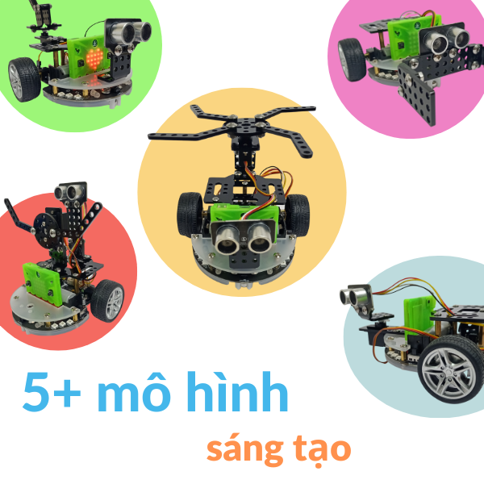
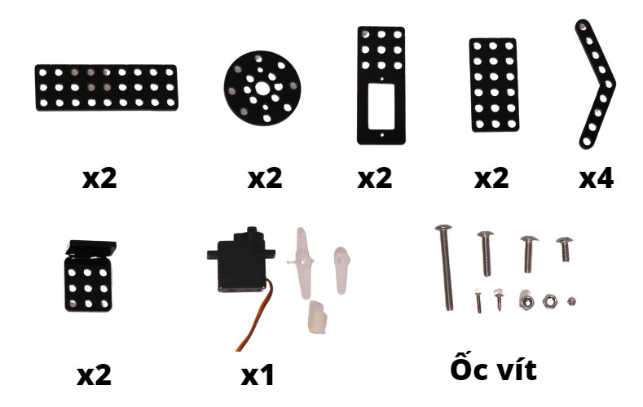

1. Giới thiệu Rover - Servo Pack
=======================

Servo pack là bộ phụ kiện sáng tạo mở rộng cho **robot Rover**, cho phép bạn sáng tạo nhiều tính năng và mô hình thú vị trên Rover. 

|

1.1 Mua sản phẩm
---------
----------

..  image:: images/gio.png
    :alt: some image
    :target: https://ohstem.vn/product/phu-kien-rover-servo-pack/
    :class: with-shadow
    :scale: 100%
    :align: center
|

1.2 Tổng quan về Rover - Servo Pack
--------------
--------------------

Bộ phụ kiện có thể lắp ráp được thành 5 mô hình cho Rover, ví dụ như Robot trực thăng, mèo dò đường, chó vẫy đuôi,… hoặc có thể nhiều hơn tùy vào trí tưởng tưởng và sáng tạo của người dùng. 

Servo Pack gồm nhiều thành phần lắp ráp được làm từ mica, mang lại sự chắc chắn, có độ bền cao và có tính an toàn. Ngoài ra, bộ phụ kiện còn kèm thêm các loại module điện tử như động cơ Servo - dùng để xoay và điều khiển các bộ phận trên robot. 

Sản phẩm có kèm hướng dẫn lắp ráo chi tiết bằng video. 

1.3 Bộ phụ kiện bao gồm
--------------
-------------- 

- Động cơ Servo DS - S006L 180 độ
- Các thành phần lắp ráp bằng mica 
- Các phụ kiện hỗ trợ lắp ráp (Bu lông, đai ốc và trụ nhựa)

1.4 Danh sách các thành phần 
------------
-------------

|

