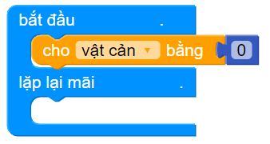

1. Bài 1: Robot Mèo dò đường
=================================

1.  Hướng dẫn lắp ráp
---------------
-------------------------

.. raw:: html

 <iframe width="560" height="315" src="https://www.youtube.com/embed/e0jEGLDBk8U?list=PLtkN2G0bngmuZSIHfJN7RDPv3TnY5HaRA" title="YouTube video player" frameborder="0" allow="accelerometer; autoplay; clipboard-write; encrypted-media; gyroscope; picture-in-picture" allowfullscreen></iframe>
| 

2.  Cách thực hiện
---------------------------
----------------------

- Khối lệnh bắt đầu chương trình:

|

3.  Viết chương trình
---------------------
--------------------------

**Chương trình đơn giản:** Đây là chương trình điều khiển Rover đi tới và lùi, giúp bạn làm quen với lập trình điều khiển Rover di chuyển

    1.  Gắn khối lệnh di chuyển vào lệnh lặp lại mãi

    .. image:: images/bai_1.9.png
        :width: 800px
        :align: center  
    |
    2. Chọn hướng di chuyển và chỉnh tốc độ mong muốn

        - Có 4 hướng di chuyển: tiến tới, lùi lại, rẽ trái, rẽ phải tương ứng với hình dạng mũi tên.

        - Tốc độ của động cơ có giá trị từ 0 (đứng yên) đến 100 (tối đa).

    .. image:: images/bai_1.10.png
        :width: 400px
        :align: center
    |

4.  Giải thích chương trình
---------------------------
----------------------

- Khối lệnh bắt đầu chương trình:

|

**Chương trình di chuyển với thời gian:**  Chương trình này sẽ giúp Rover đi theo hình vuông

    1.  Gắn khối lệnh lặp số lần vào lệnh bắt đầu

    .. image:: images/bai_1.15.png
        :width: 700px
        :align: center 
    |  
    2. Sử dụng các khối lệnh di chuyển để hoàn thiện chương trình như hình minh họa (để ý các thông số)

    .. image:: images/bai_1.16.png
        :width: 600px
        :align: center 
    |

Chương trình mẫu
--------------
-------------------

- Nhấp vào chữ **tại đây** để xem chương trình mẫu, hoặc quét mã QR bên dưới để xem chương trình.

- Robot di chuyển tới lui: `Tại đây <https://app.ohstem.vn/#!/share/yolobit/2BeTmtVhptwmDZJMtzCrBz2Hc5n>`_

.. image:: images/bai_1.17.png
    :width: 200px
    :align: center 
| 
- Robot di chuyển hình vuông: `Tại đây <https://app.ohstem.vn/#!/share/yolobit/2BeTxamvWwDappzIrPkZx9j7xl3>`_

.. image:: images/bai_1.18.png
    :width: 200px
    :align: center 
