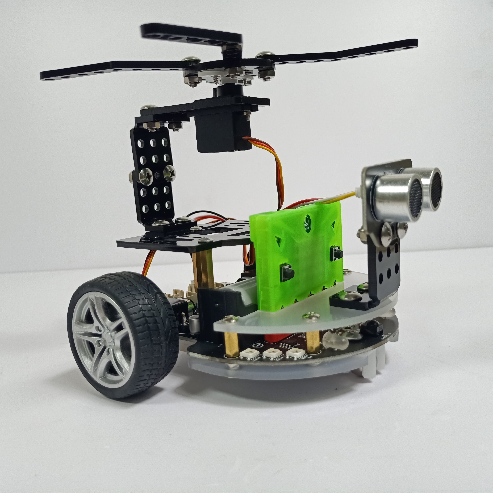
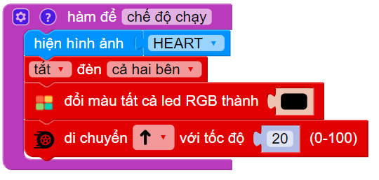
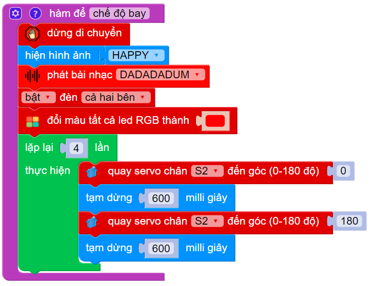

6. Bài 5: Robot trực thăng
=================================

|

1.  Hướng dẫn lắp ráp
---------------
-------------------------

.. raw:: html

 <iframe width="560" height="315" src="https://www.youtube.com/embed/5RrJXbVgBmQ" title="YouTube video player" frameborder="0" allow="accelerometer; autoplay; clipboard-write; encrypted-media; gyroscope; picture-in-picture" allowfullscreen></iframe>
| 

2.  Cách thực hiện
------------------------
----------------

- Cho Robot đi thẳng liên tục

- Khi gặp vật cản sẽ dừng lại, nháy đèn (bật đèn 2 bên và led RGB), phát nhạc, bật chế độ bay lên để né vật cản (quay động cơ servo).

3. Viết chương trình 
-----------
------------------

1. Đầu tiên, chúng ta viết hàm thiết lập trạng thái mặc định của Robot

    - Tạo hàm **chế độ chạy**
    - Chọn ảnh mặc định HEART, tắt hết đèn 
    - Cho Robot di chuyển thẳng với tốc độ tùy chỉnh (nên chỉnh tốc độ dưới 50 để giảm quán tính khi robot dừng đột ngột)

|

2. Tiếp theo, chúng ta viết hàm để Robot có thể bay lên để né vật cản bao gồm:

    - Tạo hàm **chế độ bay**
    - Dừng di chuyển và hiện hình ảnh Happy
    - Bật đèn và phát nhạc
    - Quay cánh quạt 

        + Quay chân servo đến góc 0 trong 600 milli giây. 
        + Tương tự, quay chân servo đến góc 180 

|

3. Ở chương trình chính, ta liên tục đọc cảm biến khoảng cách, nếu:

    - Nhỏ hơn 15cm: Thực hiện gọi hàm **chế độ bay**
    - Lớn hơn 15cm: Thực hiện gọi hàm **chế độ chạy**

|

4. Chương trình mẫu
--------------
-------------------

- Robot trực thăng: `Tại đây <https://app.ohstem.vn/#!/share/yolobit/2DQBdWX3EhaEBXtU2Dq3gWPP8y2>`_

| 