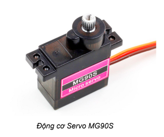

**Tay gắp Robot Gripper**
=============

1. Giới thiệu
----------
----------

Tay gắp Robot Gripper là một bộ phận mở rộng của Robot Rover, giúp thực hiện các nhiệm vụ như gắp thả và di chuyển đồ vật. 

.. raw:: html

    <iframe width="560" height="315" src="https://www.youtube.com/embed/J46WzkG8D4I" title="YouTube video player" frameborder="0" allow="accelerometer; autoplay; clipboard-write; encrypted-media; gyroscope; picture-in-picture" allowfullscreen></iframe>

|

2. Link sản phẩm 
-------
------------

|

3. Hướng dẫn lắp ráp
-----------------
-----------------

.. raw:: html

    <iframe width="560" height="315" src="https://www.youtube.com/embed/BrOdZssE76c" title="YouTube video player" frameborder="0" allow="accelerometer; autoplay; clipboard-write; encrypted-media; gyroscope; picture-in-picture" allowfullscreen></iframe>

|

4. Hướng dẫn lập trình 
---------
-----------

Để Gripper có thể thực hiện được nhiệm vụ, chúng ta cần sử dụng động cơ servo MG90S, một động cơ cho lực kéo khỏe và độ bền cao..
 
Động cơ servo có thể thực hiện được lệnh xoay cánh tay động cơ đến vị trí được lập trình sẵn (từ 0 đến 180 độ) một cách tức thời hoặc theo một tốc độ cho trước.

Chiều xoay của động cơ servo là hướng khi chúng ta quan sát trực diện với mặt trục xoay. Theo quay ước, chiều xoay từ phải sang trái tức ngược chiều kim đồng hồ của động cơ servo sẽ tính từ góc 0 độ đến 180 độ.

Servo MG90S có 3 dây tín hiệu như sau:

    + Dây nâu: cấp nguồn âm

    + Dây đỏ: Cấp nguồn dương (3.3-6 vôn DC)

    + Dây cam: dây tín hiệu điều khiển.

**Giới thiệu khối lệnh**

Trong thư viện **Rover**, sử dụng khối lệnh sau để điều khiển servo của tay gắp Gripper: 

..  figure:: images/tay_gap_3.png
    :scale: 100%
    :align: center

    Điều khiển động cơ servo 180 độ quay tới 1 góc nào đó từ 0-180. 

.. note::

    Trên Rover, có 2 cổng kết nối để điều khiển servo S1 và S2. Khi lập trình bạn cần chọn đúng cổng đã kết nối!

**Viết chương trình điều khiển tay gắp**

Lập trình robot mở tay gắp trong 2 giây, sau đó đóng tay gắp trong 2 giây. Lặp lại liên tục. 

    **Cách hoạt động:**

    .. image:: images/tay_gap_4.png
        :scale: 80%
        :align: center

    **Lập trình:**

    .. image:: images/tay_gap_5.png
        :scale: 100%
        :align: center
| 
