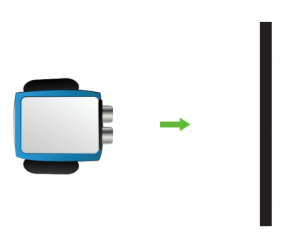
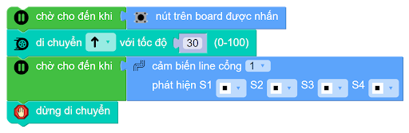
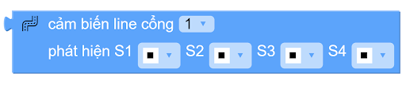

2. 1. Robot di chuyển và tự dừng trước vạch đen
============

Trong dự án xBot này, chúng ta sẽ viết chương trình đểu sau khi nhấn nút, robot di chuyển về phía trước và tự dừng trước vạch đen.

**1. Video hướng dẫn lập trình:**
------------
-----------

.. raw:: html

    <iframe width="560" height="315" src="https://www.youtube.com/embed/GcI-Nf485Pc" title="YouTube video player" frameborder="0" allow="accelerometer; autoplay; clipboard-write; encrypted-media; gyroscope; picture-in-picture; web-share" allowfullscreen></iframe>
|

**2. Chương trình hoàn chỉnh:**
------
------

|

**3. Giải thích chương trình:**
-----------
----------

Chúng ta sẽ thêm phần khối lệnh chờ nút nhấn được nhấn để bắt đầu chương trình:

|

Khối lệnh bên dưới sẽ giúp robot di chuyển. Bạn có thể thay đổi hướng di chuyển (tới, lùi, rẽ trái, rẽ phải) và tốc độ nhanh hoặc chậm bằng nhập giá trị từ 0 – 100.

|

Khối lệnh điều khiển cảm biến dò đường:

|

Khối lệnh được thiết lập như trên sẽ trả về giá trị True nếu như 4 mắt đọc của cảm biến dò line đều nằm trên vạch đen. Chỉ cần 1 trong 4 mắt đọc không nằm trên vạch đen thì khối lệnh sẽ trả về giá trị False. 

Ta kết hợp khối lệnh này với khối lệnh **"chờ cho đến khi"** để khi xBot di chuyển, nó sẽ luôn kiểm tra các kết quả trả về từ cảm biến dò line. Nếu xBot chạm vạch đen, thì khối lệnh tiếp theo mới được thực hiện

|

Để robot xBot dừng di chuyển, chúng ta sử dụng khối lệnh bên dưới:

|

Để bắt đầu lại nhiệm vụ, ta chỉ cần nhấn lại nút nhấn trên xBot.

**4. Tải chương trình mẫu**
---------------
---------

Bạn có thể sử dụng trực tiếp chương trình mẫu chúng tôi đã lập trình sẵn cho bạn tại đây. 

* :download:`Robot di chuyển và tự dừng trước vạch đen <https://app.ohstem.vn/#!/share/xbot/1yX6G5tt8GG9xojfc8UCse7JNvg>`