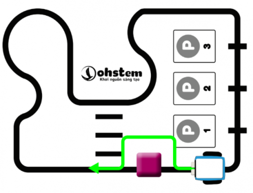
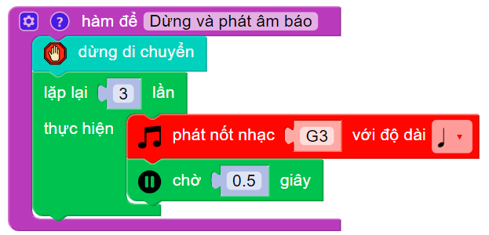
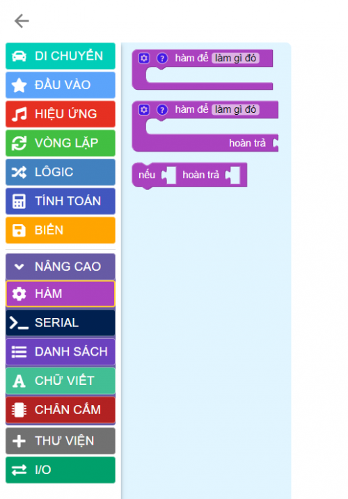
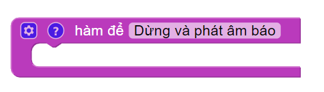
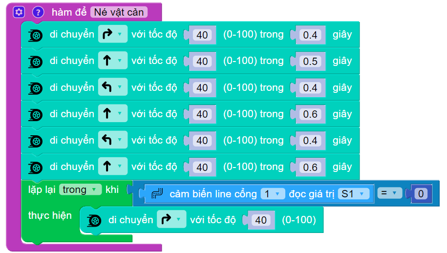
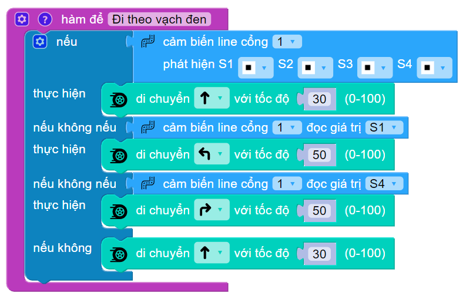
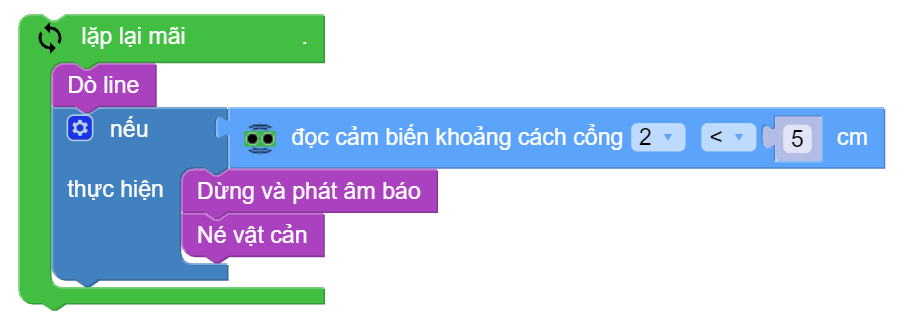

2. 4. Robot dò đường kết hợp né vật cản
=======

Trong dự án xBot này, chúng ta sẽ cùng lập trình sao cho robot dò đường kết hợp né vật cản một cách chính xác nhất.

Bạn cần sử dụng bản đồ đi kèm với xBot trong bài hướng dẫn này. Chúng ta sẽ đặt 1 vật cản ở vị trí bất kỳ trên vạch đen và nhiệm vụ của robot là vừa di chuyển theo vạch, vừa né tránh vật cản.

**1. Video hướng dẫn lập trình:**
------------
-----------

.. raw:: html

    <iframe width="560" height="315" src="https://www.youtube.com/embed/DfjBvW5q-1s" title="YouTube video player" frameborder="0" allow="accelerometer; autoplay; clipboard-write; encrypted-media; gyroscope; picture-in-picture; web-share" allowfullscreen></iframe>

|

**2. Hướng dẫn viết chương trình**
------
------

Để giải quyết bài toán này, chúng ta cần chia làm nhiều bài toán con và sử dụng **khái niệm Hàm** đã học để xử lý từng bài toán con.

Trước tiên là bài toán né vật cản. Nếu đang di chuyển mà gặp vật cản, robot cần phải:

    
    1. Dừng lại và phát ra âm thanh cảnh báo
    2. Đi vòng qua một bên
    3. Quay về lại vạch đen ban đầu

**Hàm: Dừng lại và phát ra âm thanh cảnh báo**

|

    - Bước 1: Vào mục **Nâng cao > Hàm** :

|

    - Bước 2: Chọn khối lệnh như bên dưới và đặt tên cho hàm tùy ý. Ở đây, chúng ta đặt là **“dừng và phát âm báo”**.

|

**Hàm: Đi vòng qua vật cản**

Tương tự như trên, ta tạo hàm có tên **“né vật cản”**.

Để đi vòng qua vật cản thì cần rẽ phải => đi thẳng => rẽ trái => đi thẳng => rẽ trái => đi thẳng cho đến khi gặp vạch đen thì rẽ phải.

|

**Lưu ý**: Bạn cần phải tinh chỉnh thời gian chờ cho phù hợp với tình trạng của robot và kích thước của vật cản. Tốc độ và thời gian trong chương trình mẫu chỉ để tham khảo.

**Hàm: Đi theo vạch đen**

Tương tự như trên, ta tạo hàm có tên “dò line”.

Hàm để robot đi theo vạch đen (robot dò line) sẽ giống ở phần 2.3.

|

**Đưa các hàm vào chương trình**

Để gọi các hàm vừa tạo ở trên ra, chúng ta chỉ cần vào  mục **Nâng cao > Hàm** và tìm đúng hàm mình đã tạo.

Sau khi ghép lại thì chương trình cuối cùng sẽ như sau:

|

**4. Tải chương trình mẫu**
---------------
---------

Bạn có thể sử dụng trực tiếp chương trình mẫu chúng tôi đã lập trình sẵn cho bạn tại đây. 

* :download:`Robot di chuyển và tự dừng trước vạch đen <https://app.ohstem.vn/#!/share/xbot/1yUQouz9Pn509TCuFHkzh5a1f0p>`
