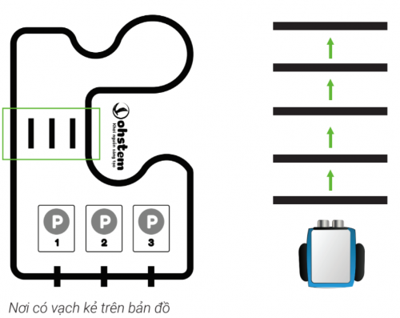
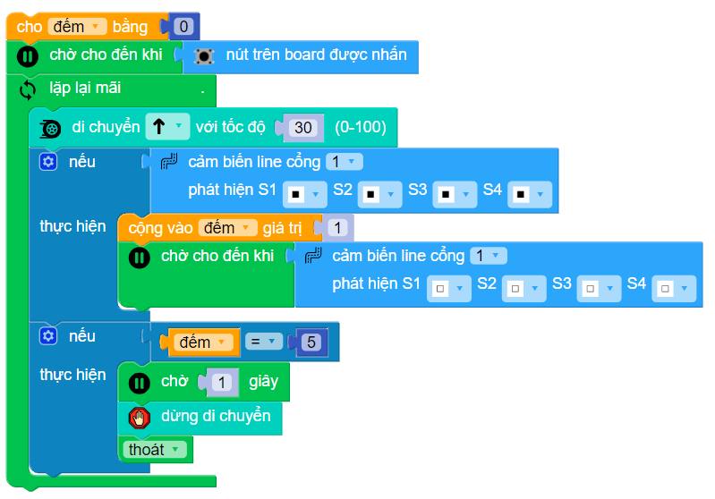
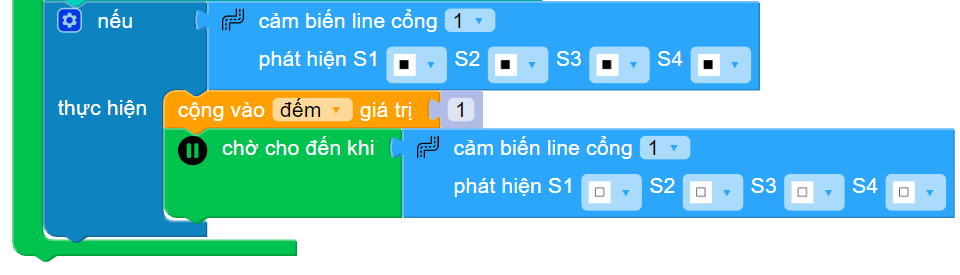
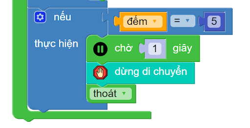

2. 2. Robot qua đường và tự dừng lại
=============

Ở dự án xBot này, chúng ta sẽ sử dụng bản đồ (đi kèm sản phẩm Robot lập trình xBot) và lập trình cho robot qua đường. Robot sẽ băng qua đường tại vị trí có vạch kẻ trên bản đồ.

|

Như bạn thấy, robot cần băng qua 5 vạch (tính cả 2 vạch của đường). Sau khi chạm vạch cuối, xBot cần di chuyển thêm một chút nữa để qua hẳn đường trước khi dừng lại.

**1. Video hướng dẫn lập trình:**
------------
-----------

.. raw:: html

    <iframe width="560" height="315" src="https://www.youtube.com/embed/u8XIEu5Hgm4" title="YouTube video player" frameborder="0" allow="accelerometer; autoplay; clipboard-write; encrypted-media; gyroscope; picture-in-picture; web-share" allowfullscreen></iframe>

|

**2. Chương trình hoàn chỉnh:**
------
------

|

**3. Giải thích chương trình:**
-----------
----------

Bạn cần tạo một biến tên là “đếm“. Ban đầu biến đếm sẽ được gán giá trị là 0.

..  figure:: images/2.3.png
    :scale: 80%
    :align: center 
|

Chúng ta sẽ thêm phần khối lệnh chờ nút nhấn được nhấn để bắt đầu chương trình:

|

Trong vòng lặp chính, ta sẽ yêu cầu robot tiến tới:

..  figure:: images/2.5.png
    :scale: 100%
    :align: center 
|

Nếu robot gặp vạch đen, giá trị biến đếm sẽ tăng 1. Đồng thời, chúng ta cần chờ cho robot di chuyển qua khỏi vạch đen để tránh đếm trùng nhiều lần.

|

Sau đó, chương trình sẽ kiểm tra xem giá trị đếm có tới số 5 chưa, nếu là số 5 thì sẽ cho robot dừng di chuyển và thoát vòng lặp để dừng chương trình:

|

**4. Tải chương trình mẫu**
---------------
---------

Bạn có thể sử dụng trực tiếp chương trình mẫu chúng tôi đã lập trình sẵn cho bạn tại đây. 

* :download:`Robot qua đường và tự dừng lại <https://app.ohstem.vn/#!/share/xbot/1yX5bvHtUSuJpNGKglnChn9Nf9t>`