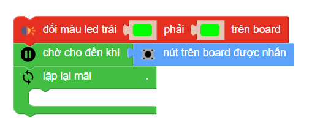

2. 6. Robot tìm chỗ trống để đậu xe
========

Trong dự án xBot này, chúng ta sẽ cùng lập trình biến xBot thành robot đậu xe thông minh – Có thể tìm chỗ trống đậu xe dựa vào khả năng **nhận diện vật cản**.

|

**1. Video minh họa**
------------
-----------

.. raw:: html

    <iframe width="640" height="360" src="https://www.youtube.com/embed/WhDVrFAdrRY" title="Lập trình robot đậu xe thông minh cùng xBot" frameborder="0" allow="accelerometer; autoplay; clipboard-write; encrypted-media; gyroscope; picture-in-picture; web-share" allowfullscreen></iframe>
|

**Cách thực hiện:** 

    1. Cho xBot đi theo vạch đen
    2. Khi gặp thanh chắn ngang, ta sẽ lập trình để căn chỉnh xBot về lại đúng vị trí của vạch đen, sau đó di chuyển tới một chút và quay sang trái để kiểm tra bãi xe đã có xe khác hay chưa:
    3. Nếu có: xBot quay sang phải 1 góc 90 độ và bắt đầu đi tiếp để quan sát bãi đậu xe khác
    4. Nếu không: xBot di chuyển tới vào bãi đậu xe và phát bài nhạc để báo hiệu, đồng thời tắt đèn LED và thoát khỏi chương trình (xBot dừng lại)

**2. Chương trình hoàn chỉnh:**
------
------

|

**3. Giải thích chương trình:**
-----------
----------

Đổi đèn LED thành màu xanh và chờ đến khi nút được nhấn, chương trình sẽ bắt đầu với vòng lặp lại mãi:

|

Tạo câu lệnh điều kiện như trong chương trình:

|

Chúng ta sẽ lập trình để xBot di chuyển theo line:

    1. Khi vạch đen ở giữa (mắt s2, s3 thấy vạch đen): xBot đi thẳng
    2. Nếu vạch đen ở bên trái (mắt s1, s2 hoặc chỉ mắt s1 phát hiện vạch đen): Cho xBot rẽ trái
    3. Tương tự cho bên phải
    4. Nếu không, cho xBot di chuyển thẳng tới trước

|

Tạo thêm một điều kiện **nếu không nếu** ở giữa như hình:

|

Nếu xBot phát hiện vạch chắn ngang (cả 4 mắt đều phát hiện vạch đen), ta cho xBot phát âm thanh để báo hiệu:

..  figure:: images/6.6.png
    :scale: 50%
    :align: center 
|

Nếu vị trí của xBot chưa thực sự thẳng hàng với vạch đen (2 mắt đọc s2, s3 không thấy vạch đen), ta cho quay động cơ phải cho đến khi xBot thực sự thẳng hàng:

|

Sau đó, cho xBot lùi lại một chút để bánh sau xBot trùng với vạch đen chắn ngang (bạn có thể tinh chỉnh tốc độ và thời gian lùi sao cho phù hợp nhất với robot của mình nhé):

|

Sau khi xBot đã vào đúng vị trí, ta cho xBot dừng di chuyển và bắt đầu đi tới trong 0,5 giây, sau đó rẽ trái một góc 90 độ để kiểm tra trong bãi xe đã có xe khác hay chưa:

|

Kiểm tra khoảng cách tới vật cản phía trước để biết trong bãi đã có xe đậu hay chưa:

    1. Nếu như robot nhận tín hiệu từ cảm biến dò khoảng cách nhỏ hơn 10 cm (tức là đã có robot đậu) thì robot sẽ quẹo trái một góc 90 độ để quay lại đường chính và tiếp tục di chuyển tới bãi đậu xe khác
    2. Nếu không, cho xBot đi tới để vào bãi xe và phát bài nhạc để báo hiệu, đồng thời tắt đèn LED và thoát khỏi vòng lặp

|

**4. Tải chương trình mẫu**
---------------
---------

Bạn có thể sử dụng trực tiếp chương trình mẫu chúng tôi đã lập trình sẵn cho bạn tại đây. 

* :download:`Robot tìm chỗ trống để đậu xe <https://app.ohstem.vn/#!/share/xbot/23JBb9T2o7AQe0v4T2MbrODB2L3>`
