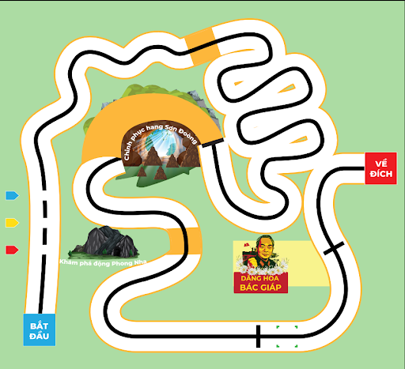

1. Giới thiệu
===========

1.1 Giới thiệu sa bàn
-----------
----------

Trong sa bàn này, robot sẽ là một nhà hướng dẫn viên tài ba, dẫn chúng ta tham quan các địa điểm du lịch, di tích nổi tiếng như động Phong Nha, hang Sơn Đoòng,... Bạn có thể đổi các địa điểm này thành danh lam thắng cảnh tại địa phương bạn tùy thích.

**Sa bàn được in bằng chất liệu bạt, kích cỡ: 2m5 x 2m75** như hình:

    Sa bàn “Khám phá động Phong Nha”

1.2 Mua bản đồ 
--------
----------

..  image:: images/gio.png
    :alt: some image
    :target: https://shop.ohstem.vn/san-pham/sa-ban-kham-pha-dong-phong-nha/
    :class: with-shadow
    :scale: 100%
    :align: center
|

1.3 Các dụng cụ cần thiết 
----------
----------

Trong tài liệu này, OhStem sẽ hướng dẫn bạn cách lập trình trên Robot Rover và bạn cần chuẩn bị sẵn các thiết bị như sau: 

.. list-table:: 
   :widths: auto
   :header-rows: 1
     
   * - .. image:: images/rover.png
          :width: 200px
          :align: center
     - .. image:: images/tay_gap_rover.jpg
          :width: 200px
          :align: center
   * - Robot Rover
     - Đầu gắp Gripper
   * - `Mua sản phẩm <https://shop.ohstem.vn/san-pham/robot-stem-rover/>`_
     - `Mua sản phẩm <https://shop.ohstem.vn/san-pham/tay-gap-robot-rover/>`_

1.4. Giới thiệu về các bài thi đấu
-----
----------

Robot sẽ thực hiện lần lượt 3 nhiệm vụ sau:

1. **Khám phá động Phong Nha**
    
    Robot sẽ tiến hành đi theo vạch đen để tiến đến khu vực hang động đá vôi đầy màu sắc, sau đó lần lượt phát sáng đèn LED với 3 màu theo thứ tự: Đỏ, vàng, xanh dương, tương ứng với 3 khoảng trống.

2. **Chinh phục động hang Sơn Đoòng**
    
    Robot cần đi qua các đoạn đường mòn quanh co khúc khuỷu, sau đó đi vòng qua thắng cảnh - khu vực không có đường line đen dẫn đường. Lúc này, các đội cần tinh chỉnh sao cho robot di chuyển một cách chính xác nhất khi không có đường line đen.

3. **Dâng hoa Bác Giáp**
    
    Trong thử thách này, robot thực hiện nhiệm vụ dâng hoa viếng thăm để tưởng nhớ đến công lao và thể hiện lòng biết ơn sâu sắc tới Đại tướng Võ Nguyên Giáp – vị tướng huyền thoại của đất nước.

    Cụ thể, Robot tiếp tục di chuyển theo vạch đen, khi tới vạch ngang là nơi đặt sẵn mô hình lẵng hoa, robot tiến hành gắp lãng hoa, di chuyển và đặt lẵng hoa tại vị trí dâng hương hoa tại đền thờ Bác Giáp.

    Số điểm gợi ý cho từng nhiệm vụ trên là 30 điểm, tổng điểm tối đa của sa bàn là 90 điểm.
