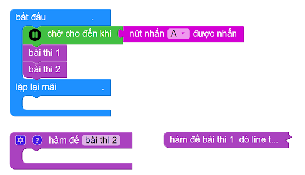
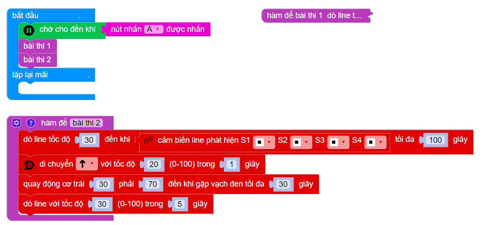

3. Nhiệm vụ 2 -  Chinh phục động hang Sơn Đoòng
============

3.1 Khu vực thi đấu & Yêu cầu 
------------
---------

Trong phần này, robot bắt đầu đi theo đoạn đường mòn quanh co khúc khuỷu, sau đó vượt qua cây cầu không có vạch đen mô phỏng hành trình leo núi và đi xung quanh di tích theo hình vòng cung để tham quan, khám phá. Sau khi đi qua di tích, robot sẽ tiếp tục đi theo vạch đen để tiến đến thử thách tiếp theo.

    Nhiệm vụ 2

Trong thử thách này, các đội cần tính toán sao cho robot của mình đi vòng qua thắng cảnh một cách chính xác vì khu vực này không có đường line đen dẫn đường.

Cách tính điểm gợi ý:
    
    - Robot không bị lệch khỏi con đường mòn: 10 điểm (Mỗi lần đi lệch hẳn ra khỏi đoạn đường mòn bị trừ 2 điểm)
    - Robot vượt qua được khu vực gò cao và quay lại được vạch đen: 20 điểm
    - Robot di chuyển đến điểm checkpoint màu vàng tiếp theo mới tính hoàn thành nhiệm vụ

3.2 Hướng dẫn viết chương trình
-------
----------

Tương tự như nhiệm vụ 1, chúng ta cũng tạo 1 hàm mới tên là **bài thi 2**, sau đó gọi tên hàm này trong chương trình chính.

|

Trước hang Sơn Đoòng (đoạn đường không có vạch đen), trên sa bàn có 1 đường line ngang để báo hiệu. Khi đó, 4 mắt của robot đều sẽ thấy màu đen. Lúc này, chúng ta tiến hành tinh chỉnh sao cho robot có thể đi qua hang Sơn Đoòng một cách thủ công, sau đó cho robot quay về đi theo vạch đen bình thường.

Với robot khi viết tài liệu này, khi đi tới (tốc độ 20) trong 1 giây, sau đó quay 2 động cơ trái phải như chương trình dưới thì robot sẽ đi qua hang Sơn Đoòng và quay lại được vạch đen. Bạn cần tinh chỉnh các thông số tốc độ và thời gian này sao cho phù hợp với robot của mình nhé!

|

3.3 **Tải chương trình mẫu**
---------------
--------

Bạn có thể tải chương trình mẫu tại đây:

* :download:`Nhiệm vụ 2 <https://app.ohstem.vn/#!/share/yolobit/2NLyPf0uDvp5ddW7HoFBighmX1q>`