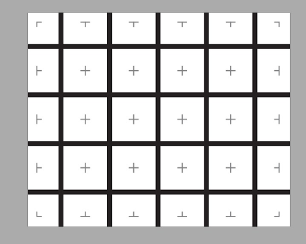

1. Giới thiệu
===========

1.1 Giới thiệu sa bàn
-----------
----------

Sa bàn thi đấu được dùng trong các cuộc thi Robocon về giải mã mê cung, gồm sa bàn và các tấm formex đi kèm, gá gắn formex để làm vách ngăn mê cung. Trên sa bàn này, học sinh cần lập trình robot đi theo vạch đen, nhận diện vách tường,... để robot có thể tự hành tìm lối ra trong mê cung.

**Sa bàn thi đấu với kích thước 1m35 x 1m, gồm các đường line đen đan chéo nhau tạo thành hình vuông. Trên bản đồ sẽ có kèm theo các tấm formex được lắp ráp thành các vách tường mê cung**

    Sa bàn mê cung

1.2. Hướng dẫn lắp ráp sa bàn
-----
-------

Bạn có thể xem hướng dẫn lắp ráp mê cung chi tiết `tại đây <https://drive.google.com/drive/folders/1CYzRHYjndL-qkfbnyMNWj_XHlxKN2pB9>`_

1.3 Các dụng cụ cần thiết 
----------
----------

Bạn có thể sử dụng robot Rover hoặc robot xBot để thi đấu trên sa bàn này đều được. Trong tài liệu này, OhStem sẽ hướng dẫn bạn cách lập trình trên robot Rover.

.. list-table:: 
   :widths: auto
   :header-rows: 1
     
   * - .. image:: images/rover.png
          :width: 200px
          :align: center
     - .. image:: images/xbot_1.png
          :width: 200px
          :align: center
   * - Robot Rover
     - Robot xBot
   * - `Mua sản phẩm <https://ohstem.vn/product/robot-stem-rover/>`_
     - `Mua sản phẩm <https://ohstem.vn/product/robot-lap-trinh-xbot-stem-robot-kit/>`_

