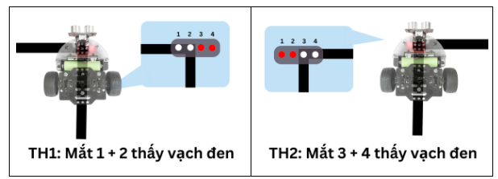
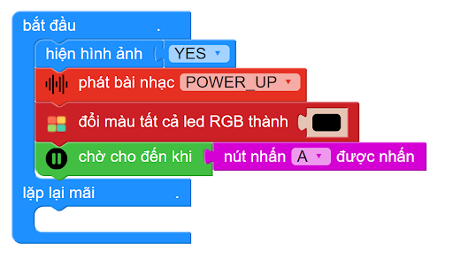
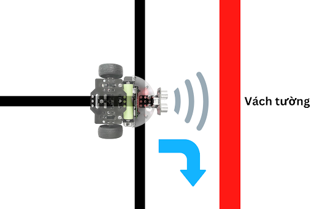
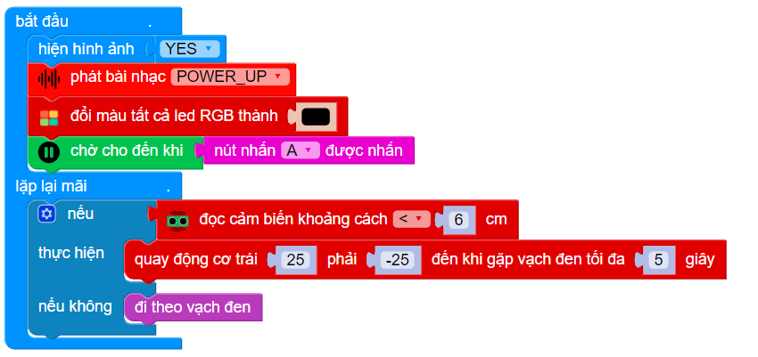
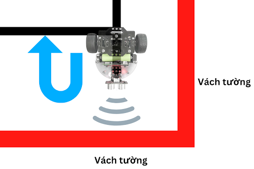
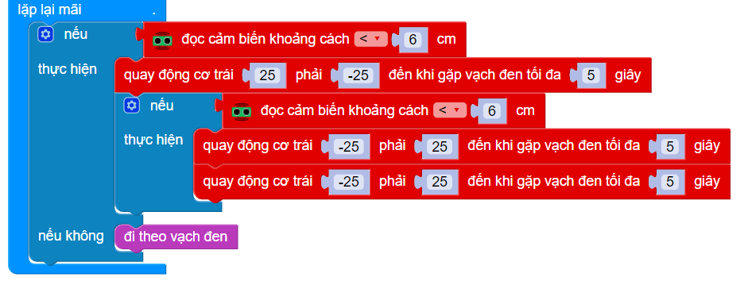
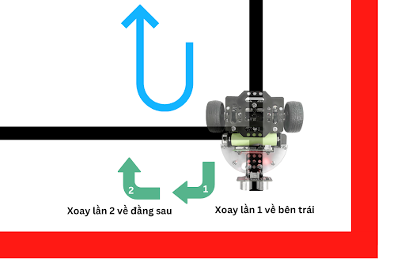
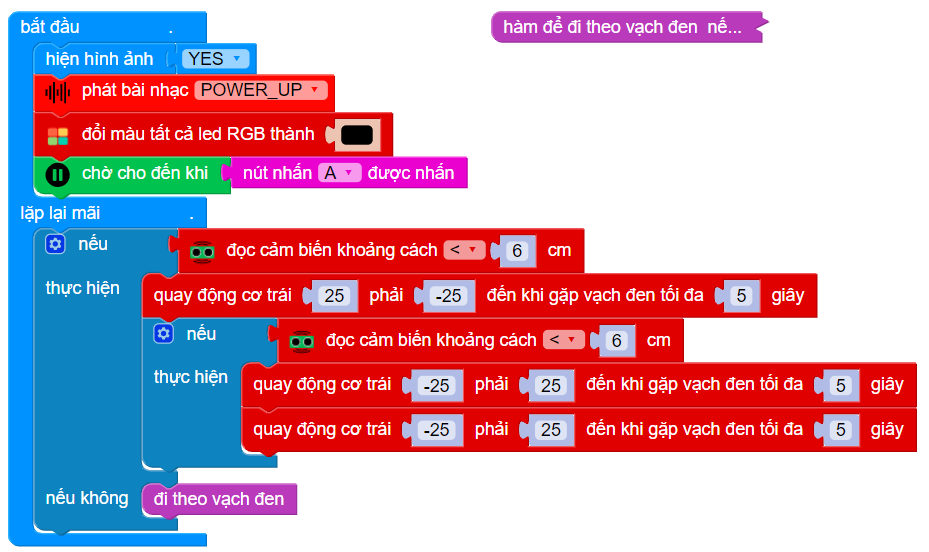

2. Hướng dẫn lập trình
=========

2.1. Thuật toán
----
------

Trong bài viết này, OhStem sẽ hướng dẫn bạn cách lập trình để robot xBot có thể tự động tìm lối ra của mê cung, dựa vào cảm biến khoảng cách và cảm biến dò đường nhé!

*Kiến thức thêm:*

..  csv-table:: 
    :header: "Tên cảm biến", "Chức năng"
    :widths: 30, 30

    "Cảm biến khoảng cách", "Giúp robot biết được phía trước có chướng ngại vật / tường của mê cung hay không"
    "Cảm biến dò đường 4 mắt", "Giúp robot theo dõi và di chuyển thẳng theo các vạch màu đen"

Thuật toán của nhiệm vụ này khá đơn giản, ban đầu robot sẽ đi theo vạch đen. Nếu gặp vật cản trước mặt, robot sẽ xoay tại chỗ liên tục cho đến khi trước mặt hết vật cản thì đi tiếp.

2.2 Hướng dẫn lập trình
----
------

Để lập trình cho robot Rover thi đấu, bạn cần tải thư viện **Robot Rover** và thư viện **Robocon**.

..  figure:: images/thu_vien.png
    :scale: 100%
    :align: center 

    Xem hướng dẫn tải thư viện `tại đây <https://docs.ohstem.vn/en/latest/module/cai-dat-thu-vien.html>`_.

Đầu tiên, chúng ta cần tạo 1 hàm để robot đi theo đường line đen. Trên cảm biến dò đường của Rover có 4 mắt đọc tín hiệu được đánh dấu từ 1 đến 4 từ trái qua phải, để nhận diện vạch đen và nền trắng. 

Chúng ta sẽ chia ra 4 trường hợp:
    
    - Mắt 1 hoặc cả mắt 1 + 2 thấy vạch đen: Robot rẽ trái
    - Mắt 3 hoặc cả mắt 3 + 4 thấy vạch đen: Robot rẽ phải
    - Cả 4 mắt không thấy vạch đen: Robot lùi lại
    - Các trường hợp khác: Robot đi thẳng

|

Dựa trên 4 trường hợp trên, chúng ta có chương trình đi theo vạch đen như sau:

..  figure:: images/me_cung_2.png
    :scale: 100%
    :align: center 
|
Để robot có thể đi theo vạch đen, chúng ta cần phải gọi tên hàm này trong chương trình chính. Trong chương trình chính, khi robot vừa được bật, chúng ta sẽ cho robot hiển thị hình ảnh YES, kèm theo phát nhạc để báo hiệu robot đã sẵn sàng. 

Khi nút A trên robot được nhấn, robot mới thực hiện các câu lệnh bên dưới (các câu lệnh để giải mê cung):

|

Theo như thuật toán, khi gặp vạch cản trước mặt, robot sẽ xoay liên tục. Như hình minh họa dưới, khi robot đi tới và gặp vật cản trước mặt, robot sẽ xoay tại chỗ sang bên phải:

|

Trong trường hợp phía trước không có vách tường, robot cứ tiếp tục đi theo đường line đen theo chương trình mà chúng ta đã xây dựng trong hàm lúc nãy. Các khối lệnh này được đặt trong lặp lại mãi, để chúng luôn lặp lại liên tục.

Chương trình sẽ như dưới:

|

**Giải thích:** 
    
    Khối lệnh trong mục thực hiện bên trên sẽ giúp robot xoay sang phải liên tục cho đến khi gặp vạch đen, lúc đó robot sẽ dừng lại. Thời gian quy định tối đa là 5 giây, nếu 5 giây kết thúc mà robot vẫn chưa thấy vạch đen thì robot vẫn tự động dừng lại. Mốc thời gian này giúp chúng ta tránh được trường hợp robot xoay liên tục không dừng.

Tuy nhiên, trong trường hợp robot đã xoay sang phải, nhưng trước mặt vẫn có vách tường thì sao? Lúc này, chúng ta cần cho **robot xoay sang phải 2 lần**, để quay ngược lại và đi theo hướng duy nhất còn lại:

|

Chương trình sẽ như sau:

|

**Giải thích:** Khối lệnh “quay động cơ trái …” được sử dụng 2 lần liên tiếp, để đảm bảo robot có thể xoay 2 lần về đúng hướng còn lại:

|

**Chương trình hoàn chỉnh lúc này sẽ như sau:**

|

2.3 **Tải chương trình mẫu**
---------------
--------

Bạn có thể sử dụng trực tiếp chương trình mẫu về robot giải mê cung mà chúng tôi đã lập trình sẵn cho bạn tại đây.

* :download:`Bài thi giải sa bàn mê cung <https://app.ohstem.vn/#!/share/yolobit/2NMgaVDjKynX0DEwbj5H8Sm28qs>`