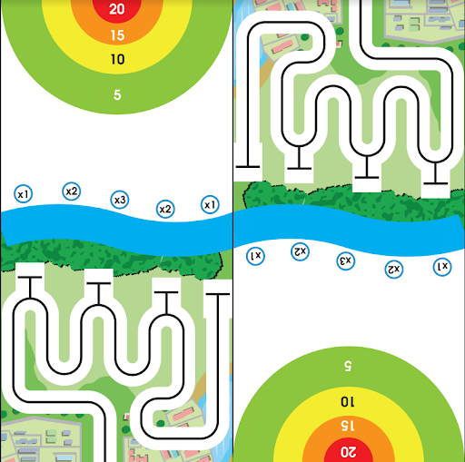

1. Giới thiệu
===========

1.1 Giới thiệu sa bàn
-----------
----------

Sa bàn này được thiết kế để tổ chức các cuộc thi Robocon, trong đó các robot của các đội sẽ phối hợp với nhau để hoàn thành nhiệm vụ đặt ra, từ ném bóng, di chuyển theo vạch đen đến di chuyển bóng.

Sa bàn cho phép 2 đội thi đối kháng cùng lúc với nhau, phù hợp để bạn tổ chức cuộc thi cho học sinh trong lớp hoặc trong trường hoặc nhiều trường với nhau.

**Sa bàn được in bằng chất liệu bạt, kích cỡ: 4m x 4m** như hình:

    Sa bàn robot bắn bóng

Trên bản đồ sẽ có kèm theo 8 mô hình vòng ném bóng kèm theo 10 quả bóng để phục vụ cho các thử thách trong cuộc thi Robot.

Vòng ném bóng có kích thước cao khoảng 30 - 45cm, đường kính vòng tròn khoảng 20cm. Quả bóng để bắn có đường kính khoảng 4cm.

1.2 Mua sa bàn 
----
-------

..  image:: images/gio.png
    :alt: some image
    :target: https://ohstem.vn/product/sa-ban-robot-ban-bong/
    :class: with-shadow
    :scale: 100%
    :align: center
|

1.3 Các dụng cụ cần thiết 
----------
----------

Trong tài liệu này, OhStem sẽ hướng dẫn bạn cách lập trình trên Robot Rover và bạn cần chuẩn bị sẵn các thiết bị như sau: 

    1. Robot Rover (kèm Yolo:Bit) hoặc robot xBot
    2. Phụ kiện bắn bóng cho robot số 1
    3. Phụ kiện tay gắp cho robot số 2

.. list-table:: 
   :widths: auto
   :header-rows: 1
     
   * - .. image:: images/rover.png
          :width: 200px
          :align: center
     - .. image:: images/tay_gap_rover.jpg
          :width: 200px
          :align: center
     - .. image:: images/ban_bong.jpg
          :width: 200px
          :align: center
   * - Robot Rover
     - Đầu gắp Gripper
     - Phụ kiện bắn bóng
   * - `Mua sản phẩm <https://ohstem.vn/product/robot-stem-rover/>`_
     - `Mua sản phẩm <https://ohstem.vn/product/tay-gap-robot-rover/>`_
     - `Mua sản phẩm <https://ohstem.vn/product/phu-kien-ban-bong-dung-cho-robot/>`_

1.4 Giới thiệu về các bài thi đấu
-----
----------

Sa bàn cho phép 2 đội thi đối kháng cùng lúc với nhau. Mỗi đội sẽ điều khiển 2 robot phối hợp nhau, để thực hiện các nhiệm vụ sau:

1. **Robot 1**
    
    Robot đi theo đường kẻ và bắn bóng qua các vòng ném bóng, sao cho bóng rơi vào các ô điểm, sao cho đạt điểm cao nhất có thể.

2. **Robot 2**
    
    Đây là vòng thi giúp nhân số điểm mà robot 1 đã đạt được. Trên sa bàn có các ô không nhân điểm (x1), ô nhân đôi điểm (x2) và ô nhân ba điểm (x3). Robot nhặt bóng và di chuyển đến các ô nhân điểm, sao cho tổng điểm cao nhất. Mỗi ô nhân điểm chỉ được chứa 1 quả bóng, và sau khi đặt bóng vào ô nhân điểm thì không được thay đổi.

