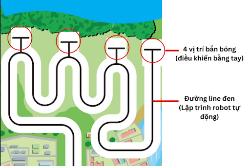

2. Lập trình robot 1 - Tạo bảng điều khiển
=========

Dưới đây là khu vực hoạt động của robot số 1 của mỗi đội. Đây là phần thi đặc biệt, các robot cần phải chuyển đổi giữa 2 chế độ robot tự hành và điều khiển robot bằng tay linh hoạt. 

Cụ thể, lúc đầu các robot cần phải tự hành di chuyển theo đường line. Khi tới vị trí bắn bóng thì chuyển qua chế độ điều khiển bằng tay để các đội điều khiển robot canh góc bắn, sao cho đạt điểm cao nhất.

|

Để thực hiện được điều đó, chúng ta sẽ tạo ra 1 bảng điều khiển riêng, có hỗ trợ cả 2 chế độ điều khiển này. Bạn tham khảo video hướng dẫn bên dưới nhé!

.. raw:: html

    <iframe width="560" height="400" src="https://www.youtube.com/embed/ovuFXKOEp10" title="YouTube video player" frameborder="0" allow="accelerometer; autoplay; clipboard-write; encrypted-media; gyroscope; picture-in-picture; web-share" allowfullscreen></iframe> 
|

3. Robot 2 - Điều khiển bằng tay
============

Với robot này, bạn có thể trực tiếp điều khiển robot bằng điện thoại / laptop hoặc máy tính bảng thông qua phần mềm OhStem App. Ngoài ra, bạn cũng có thể điều khiển robot bằng GamePad do OhStem cung cấp tùy thích.

