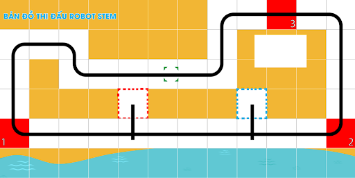

1. Giới thiệu
==============

1.1 Giới thiệu sa bàn
-----------
----------

Đây là sa bàn thi đấu robot STEM cơ bản, phù hợp để bạn triển khai cuộc thi Robocon cho học sinh ở cấp độ đơn giản, với những thử thách như robot đi theo vạch đen, robot di chuyển hàng hóa hoặc robot né tránh vật cản.

**Sa bàn được in bằng chất liệu bạt, với kích thước 1m2 x 2m4**. Trên bản đồ sẽ có kèm theo 5 mô hình gạch xốp để phục vụ cho các thử thách trong cuộc thi Robot.

    Sa bàn thi đấu robot cơ bản. 

1.2 Mua bản đồ 
--------
----------

..  image:: images/gio.png
    :alt: some image
    :target: https://shop.ohstem.vn/san-pham/sa-ban-robot-co-ban/
    :class: with-shadow
    :scale: 100%
    :align: center
|

1.3 Các dụng cụ cần thiết 
----------
----------

Trong tài liệu này, OhStem sẽ hướng dẫn bạn cách lập trình trên Robot Rover và bạn cần chuẩn bị sẵn các thiết bị như sau: 

.. list-table:: 
   :widths: auto
   :header-rows: 1
     
   * - .. image:: images/rover.png
          :width: 200px
          :align: center
     - .. image:: images/tay_gap_rover.jpg
          :width: 200px
          :align: center
   * - Robot Rover
     - Đầu gắp Gripper
   * - `Mua sản phẩm <https://shop.ohstem.vn/san-pham/robot-stem-rover/>`_
     - `Mua sản phẩm <https://shop.ohstem.vn/san-pham/tay-gap-robot-rover/>`_

1.4 Giới thiệu về các bài thi đấu 
------
------------

Trên sa bàn này, robot cần thực hiện 3 nhiệm vụ chính:

- **Nhiệm vụ 1 và 2: Robot nhận và giao hàng tự động**

    Robot sẽ hóa thân thành người giao hàng và gắp mô hình hàng hóa được đặt sẵn tại vị trí vạch ngang, sau đó đặt hàng hóa vào ô vuông bên trái tương ứng. 

    2 vị trí cần hàng - giao hàng màu đỏ và màu xanh trên bản đồ tương ứng với nhiệm vụ 1 và 2. Số điểm gợi ý cho mỗi lượt nhận hàng - giao hàng thành công là 25 điểm.

- **Nhiệm vụ 3: Robot tự né vật cản**

    Trong phần thử thách này, các đội sẽ lập trình Robot di chuyển tự động theo các vạch đen trên sa bàn. Trên đường đi, sẽ có 01 chướng ngại vật nằm cố định trên đường buộc robot phải di chuyển để tránh, đảm bảo hoàn thành đúng lộ trình.

    Số điểm gợi ý khi hoàn thành nhiệm vụ này là 50 điểm.

