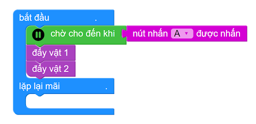

2. Nhiệm vụ 1 và 2 - Giao và nhận hàng
===========

2.1 Khu vực thi đấu & Yêu cầu 
------------
---------

Để thực hiện 2 nhiệm vụ này, trên sa bàn robot sẽ xuất phát tại vị trí ô vuông màu đỏ số 1, và kết thúc nhiệm vụ tại vị trí ô vuông màu đỏ số 3.

Tại 2 vạch ngang trên sa bàn sẽ để sẵn 2 miếng gạch xốp đánh số 1 và 2 như hình dưới, robot cần gắp chúng và thả vào ô vuông bên trái:

..  figure:: images/nhiem_vu_12.png
    :scale: 100%
    :align: center 

    Nhiệm vụ 1 và 2

2.2 Hướng dẫn viết chương trình
-------
----------

Chúng ta sẽ tạo 3 hàm, tương ứng với 3 nhiệm vụ trong thử thách này:

    1. Đi theo vạch đen
    2. Đẩy vật 1 vào ô có đường nét đứt màu đỏ
    3. Đẩy vật 2 vào ô có đường nét đứt màu xanh

1. **Hàm đi theo vạch đen**
----------

Để lập trình cho robot Rover thi đấu, bạn cần tải thư viện **Robot Rover** và thư viện **Robocon**.

    Xem hướng dẫn tải thư viện `tại đây <https://docs.ohstem.vn/en/latest/module/cai-dat-thu-vien.html>`_.

Trên cảm biến dò đường của Rover có 3 mắt đọc tín hiệu được đánh dấu từ 1 đến 4 từ trái qua phải, để nhận diện vạch đen và nền trắng. Chúng ta sẽ chia ra 3 trường hợp:
    
    - **Đi thẳng**: S1 và S4 không đọc được vạch đen
        .. image:: images/bai_9.1.png
            :width: 300px
            :align: center 

    - **Rẽ trái:**  S1 đọc được vạch đen, S4 thì không 
  
        .. image:: images/bai_9.2.png
            :width: 300px
            :align: center 

    - **Rẽ phải:** S4 đọc được vạch đen, S1 thì không 

        .. image:: images/bai_9.3.png
            :width: 300px
            :align: center 

Dựa trên 3 trường hợp trên, chúng ta có hàm đầu tiên, bên trong có chương trình như sau:

..  figure:: images/ham_di_theo_vach_den.png
    :scale: 100%
    :align: center 
|

2. Hàm đẩy vật 1 vào ô có đường nét đứt màu đỏ
----------

Trước khi lập trình, bạn cần biết góc đóng và mở trên tay gắp Rover là bao nhiêu độ, chi tiết như trong hình dưới:

..  figure:: images/dong_mo_tay_gap.png
    :scale: 100%
    :align: center 

Để đẩy vật vào ô có đường nét đứt màu đỏ, chúng ta sẽ chia nhỏ bài toán như sau:
    
    - Nhiệm vụ 1: Robot di chuyển đến lấy hàng
    - Nhiệm vụ 2: Robot rẽ trái và thả hàng tại ô nét đứt màu đỏ
    - Nhiệm vụ 3: Robot quay về đường line và tiếp tục di chuyển

- **Nhiệm vụ 1:**

    Ban đầu, khi robot vừa xuất phát, chúng ta sẽ mở tay gắp và cho robot di chuyển dò line liên tục. Đến khi 4 mắt đều phát hiện màu đen (robot tới vạch đen ngang) thì cho robot dừng di chuyển và đóng tay gắp để kẹp hàng hóa lại.

..  figure:: images/robot_thay_vach_den.png
    :scale: 100%
    :align: center 
|

    Khi đến vạch đen ngang, cả 4 mắt hồng ngoại đều nhận diện màu đen

    Khi đó, ta có thể hiện thực chương trình như sau (tạo hàm mới là đẩy vật 1 để viết chương trình):

|

- **Nhiệm vụ 2:**

    Sau khi lấy hàng xong, robot tiến hành rẽ trái và tiếp tục đi theo vạch đen, cho đến khi hết vạch đen (4 mắt đều thấy nền trắng) thì dừng di chuyển và mở tay gắp. Chương trình như sau:

..  figure:: images/day_vat_1.1.png
    :scale: 80%
    :align: center 
|

- **Nhiệm vụ 3:**

    Lúc này, robot cần lùi lại và quay trở lại đường line đen ban đầu để tiếp tục di chuyển. chương trình như sau:

|

3. Hàm đẩy vật 2 vào ô có đường nét đứt màu xanh
----------

Chúng ta cũng sẽ lập trình tương tự như khi đẩy vật 1, nhưng do lúc này tay gắp của Rover đã mở sẵn, nên chúng ta không cần câu lệnh mở tay gắp (quay Servo đến góc 0 độ) như trường hợp trên

Bạn sẽ tạo 1 hàm tương tự để chứa các khối lệnh đẩy vật 2. Chương trình chúng ta sẽ là:

|

Sau khi đã tạo xong 3 hàm, chúng ta tiến hành gọi tên hàm trong chương trình chính để robot tự chạy và thực hiện 2 thử thách này:

|

2.3 **Tải chương trình mẫu**
---------------
--------

Bạn có thể tải chương trình đầy đủ cho nhiệm vụ 1 & 2 tại đây

* :download:`Bài thi sa bàn robot cơ bản <https://app.ohstem.vn/#!/share/yolobit/2NJyYafAD1OISUteA4ovnIPYGrO>`

