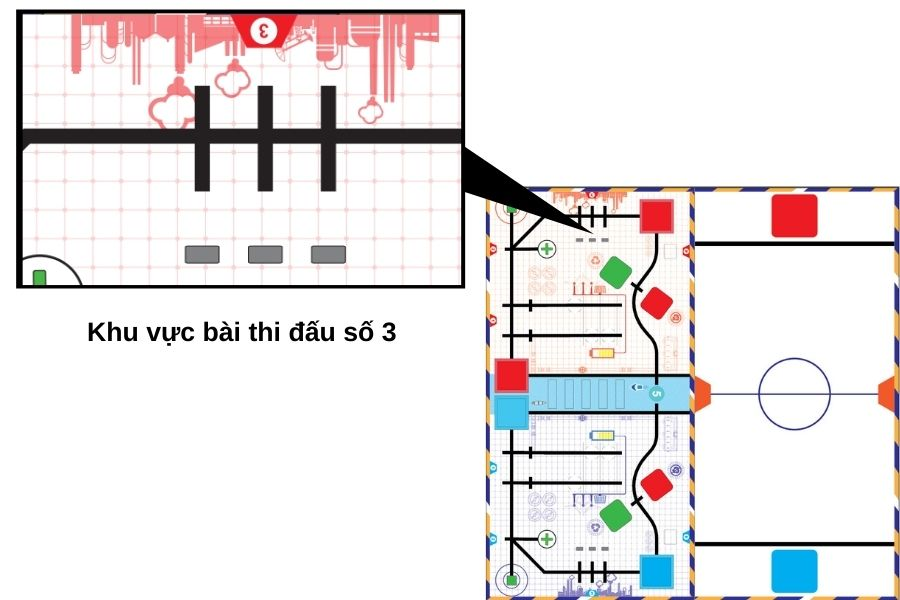
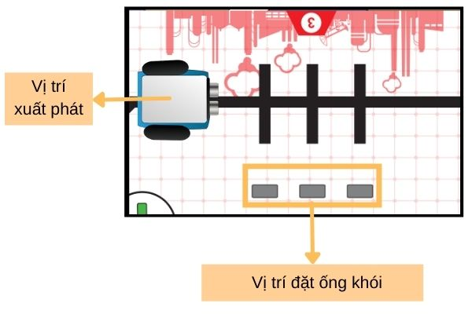

4. 2. Sa bàn thi đấu & yêu cầu 
=================

Bên dưới là khu vực trên sa bàn thi đấu mà chúng ta cần dùng cho thử thách này:

Trên sa bàn, chúng ta sẽ đặt thêm đối tượng là các ống khói tại vị trí như hình dưới. Học sinh cần lập trình cho xBot di chuyển và đẩy ngã những ống khói này.

**Lưu ý:** Bạn có thể đặt 1, 2 hoặc cả 3 ống khói vào trên sa bàn đều được, tùy vào luật chơi của bạn.