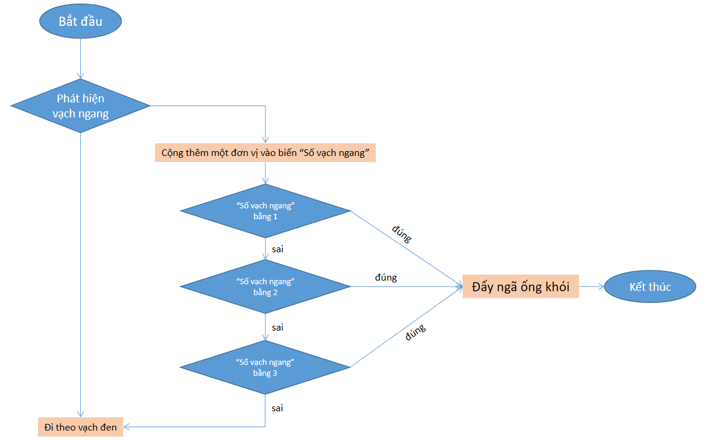

4. 3. Thuật toán và chương trình mẫu 
================

**Sơ đồ thuật toán**
-----------------

    Sơ đồ giải thuật

**Ta sẽ có các nhiệm vụ như sau:**

    1.  Đi theo vạch đen.
    2.  Xác định vạch ngang => Đẩy ngã ổng khói.

**Tải chương trình mẫu**
---------------

Bạn có thể sử dụng trực tiếp chương trình mẫu chúng tôi đã lập trình sẵn cho bạn: 

* :download:`Bài thi đấu 3 <https://app.ohstem.vn/#!/share/xbot/2HsuzuiXpLv0VGFdbB7JjegE1MW>`