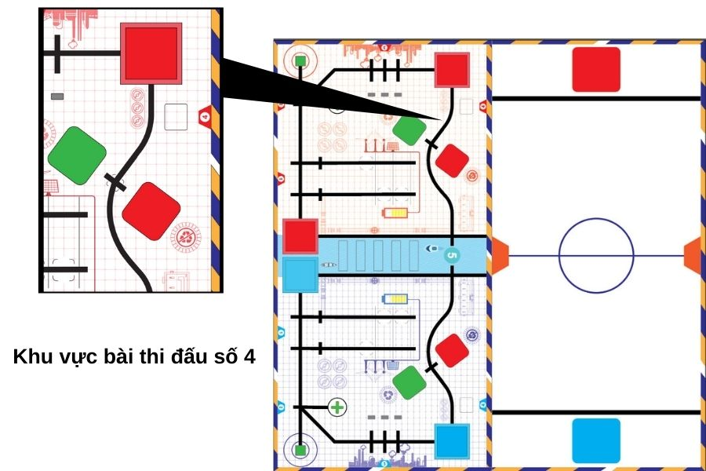
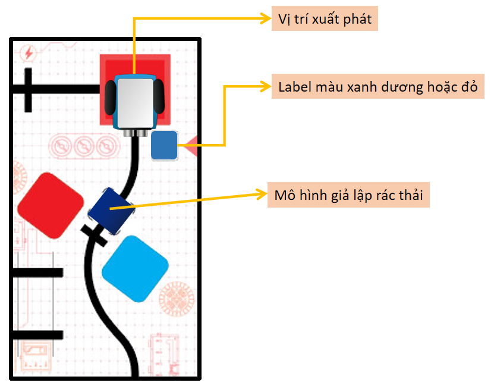

5. 2. Sa bàn thi đấu & yêu cầu 
=================

Dưới đây là khu vực trên sa bàn mà chúng ta sẽ sử dụng để phân loại rác thải:

Trên sa bàn, chúng ta sẽ có mô hình giả lập rác thải cùng với 1 tấm label màu xanh dương (hoặc màu đỏ).

Nhiệm vụ của chúng ta là lập trình để xBot di chuyển mô hình giả lập rác thải vào đúng vị trí của nó:

    1. Nếu tấm label có màu xanh: xBot cần đặt mô hình rác ở ô có màu xanh trên sa bàn
    2. Tương tự, nếu tấm label có màu đỏ, xBot cần đặt mô hình ở ô màu đỏ