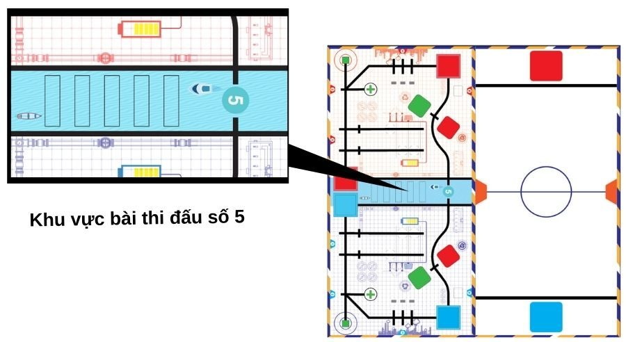
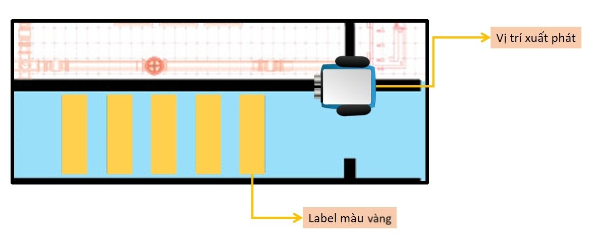

6. 2. Sa bàn thi đấu & yêu cầu 
=================

Dưới đây là khu vực chúng ta dùng để tiến hành thử thách **“Đo mức độ ô nhiễm nguồn nước”** này:

Trên sa bàn, chúng ta sẽ sử dụng thêm các tấm label có màu vàng. xBot sẽ di chuyển dọc theo đường line đen (từ vị trí xuất phát như hình bên dưới) và kiểm tra nước có bị ô nhiễm không, đang bị ô nhiễm ở mức độ nào:

    1. Mức độ 5 (Phát hiện 5 tấm label): Nguồn nước đang bị ô nhiễm nặng
    2. Mức độ 0 (Không phát hiện tấm label nào): Nguồn nước không bị ô nhiễm

Mỗi khi phát hiện 1 tấm label, xBot sẽ dừng lại và phát ra 1 âm thanh để báo hiệu, đồng thời hiển thị kết quả lên màn hình LED Matrix

**Lưu ý:** Chúng ta sẽ không sử dụng cùng lúc 5 tấm label màu vàng cùng lúc nhé! Các trọng tài nên sử dụng khoảng từ 3 hoặc 4 tấm label.