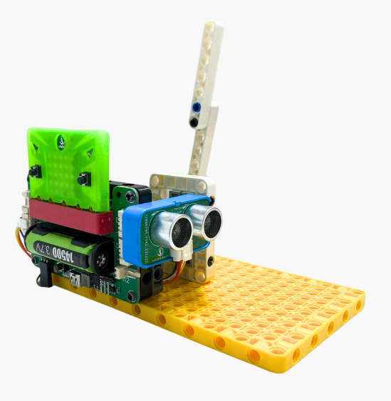
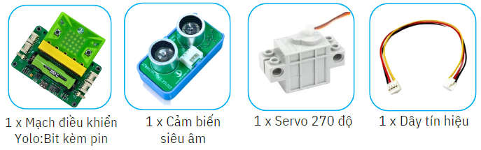
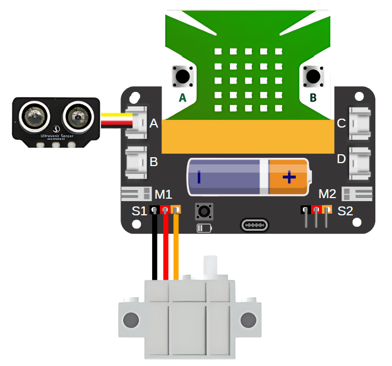
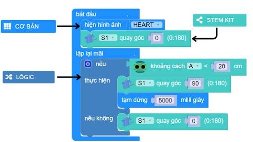

5. Bãi đậu xe thông minh
=========

1. Giới thiệu
-----
-----------

Với dự án này, học sinh sẽ thiết kế một bãi đậu xe thông minh. Giúp học sinh hiểu rõ nhu cầu trong cuộc sống ngày nay, khi phương tiện cá nhân tăng cao, nhu cầu bãi đỗ xe cũng tăng theo. Vì thế, các bãi đậu xe cần trang bị thêm các thiết bị hiện đại để giúp cho việc đỗ xe một các dễ dàng và nhanh chóng hơn mà không cần sự điều khiển của con người. Thanh chắn bãi đậu xe sẽ tự động mở khi phát hiện xe ra vào bãi đậu.

|

Các kiến thức và kỹ năng đạt được trong dự án này như sau: 

..  csv-table:: 
    :widths: 15, 45

    "**Khoa học & Toán học**", "- Tìm hiểu các vấn đề thực tế như quản lý bãi đổ xe
    - Nguyên lý hoạt động của cảm biến siêu âm
    - Lập trình điều khiển các thiết bị hoạt động"
    "**Công nghệ**", "Cảm biến siêu âm, động cơ servo"
    "**Kỹ thuật**", "Đọc hướng dẫn lắp ráp, hoàn thiện mô hình"
    "**Nghệ thuật**", "Mô hình bắt mắt, trang trí và tô màu"
    "**Kỹ năng**", "Thuyết trình, làm việc nhóm, giải quyết vấn đề"

2. Hướng dẫn lắp ráp
----
--------

- **Chuẩn bị**: 

|

- **Hướng dẫn lắp ráp**:

    **Đang cập nhật**

- **Kết nối dây**:

    + Cảm biến khoảng cách vào cổng A
    + Servo cổng S1

|

3. Hướng dẫn lập trình
--------
--------

Viết chương trình như sau: 

|

**Link chương trình:** `<https://app.ohstem.vn/#!/share/yolobit/2diYSkpDtk2I7F4CiO6LDSlyQAs>`_

.. note:: 

    Thanh chắn bãi đậu xe luôn ở vị trí đóng, do đó cần đặt thanh chắn ở vị trí nằm ngang tức là servo ở góc 0 độ. Nếu cảm biến khoảng cách phát hiện xe trong phạm vi 20cm, thì mở thanh chắn trong 5 giây. Nếu không có xe, thì đóng thanh chắn. 
 
