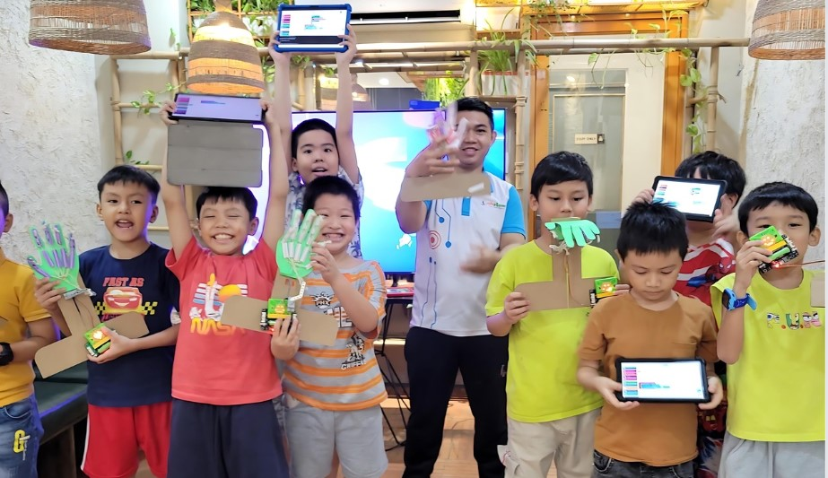
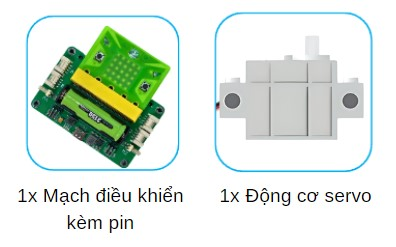
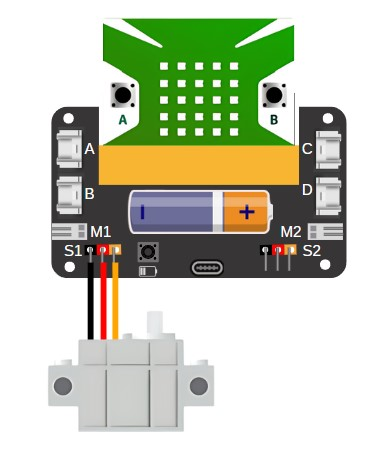
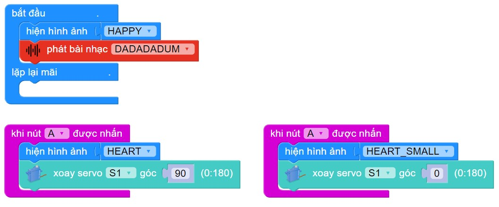

22. Bàn tay mô phỏng
=======

1. Giới thiệu
-----
-----------

Với chủ đề này, học sinh được thiết kế, lắp ráp và lập trình mô hình hoạt động như cấu tạo của bàn tay người. 

|

Các kiến thức và kỹ năng đạt được trong dự án này như sau: 

..  csv-table:: 
    :widths: 15, 45

    "**Khoa học & Toán học**", "- Nêu được cấu tạo và chức năng của bàn tay người
    - Giải thích được nguyên lý hoạt động của mô hình bàn tay robot
    - Tính toán được tốc độ hoạt động, góc xoay của động cơ servo sau cho mô hình bàn tay hoạt động tốt nhất."
    "**Công nghệ**", "- Động cơ servo, các nút nhấn trên mạch điều khiển"
    "**Kỹ thuật**", "- Thiết kế mô hình bàn tay"
    "**Kỹ năng**", "- Phát triển khả năng sáng tạo, tư duy logic, kỹ năng làm việc nhóm"

2. Hướng dẫn lắp ráp
----
--------

- **Chuẩn bị**: 

|     

- **Kết nối dây**:

    + Kết nối động cơ servo vào cổng S1

|

3. Hướng dẫn lập trình
--------
--------

Viết chương trình như sau: 

|

**Link chương trình:** `<https://app.ohstem.vn/#!/share/yolobit/2iidBGDvzPSxPEjtAI8m2END1Fv>`_

.. note:: Chương trình sẽ thực hiện như sau: 

    Bàn tay sẽ đóng mở khi nhấn nút A, B trên mạch điều khiển. 

