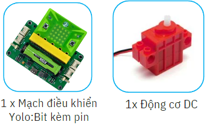
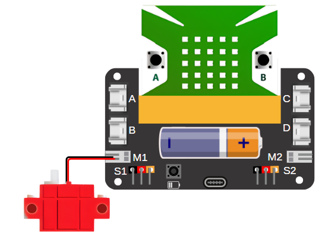
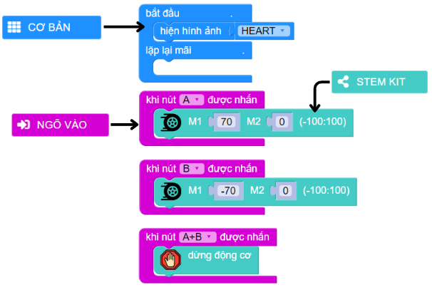

15. Cáp treo
=========

1. Giới thiệu
-----
-----------

Với chủ đề cáp treo, học sinh sẽ thực hiện chế tạo mô hình cáp treo hoạt động gần giống với nguyên lý vận hành trong thực tế và được ứng dụng trong nhiều lĩnh vực đời sống, bao gồm vận chuyển hàng hóa, du lịch….

Các kiến thức và kỹ năng đạt được trong dự án này như sau: 

..  csv-table:: 
    :widths: 15, 45

    "**Khoa học & Toán học**", "- Lợi ích và công dụng của cáp treo trong thực tế 
    - Tìm hiểu về khái niệm động cơ là gì, động cơ Servo và phân loại
    - Lập trình điều khiển động cơ hoạt động"
    "**Công nghệ**", "Động cơ DC"
    "**Kỹ thuật**", "Thiết kế, sáng tạo, hoàn thiện mô hình"
    "**Nghệ thuật**", "Mô hình bắt mắt, trang trí và tô màu"
    "**Kỹ năng**", "Kỹ năng thiết kế theo quy trình TK kỹ thuật"

2. Hướng dẫn lắp ráp
----
--------

- **Chuẩn bị**: 

|

- **Hướng dẫn lắp ráp**:

    **Đang cập nhật**

- **Kết nối dây**:

    + Kết nối động cơ DC vào cổng M1

|

3. Hướng dẫn lập trình
--------
--------

Viết chương trình như sau: 

|

**Link chương trình:** `<https://app.ohstem.vn/#!/share/yolobit/2dqo4WVxzvsjKwoaLyeN2qBNeBy>`_

.. note:: Chương trình sẽ thực hiện như sau: 

    - Khi nhấn nút A, cáp treo sẽ di chuyển về phía trước, tức là động cơ M1 hoạt động ở tốc độ 70. 
    - Khi nhấn nút B, cáp treo sẽ di chuyển hướng ngược lại, tức là động cơ M1 hoạt động ở tốc độ -70. 
    - Khi nhấn A+B, cáp treo sẽ dừng di chuyển. 

