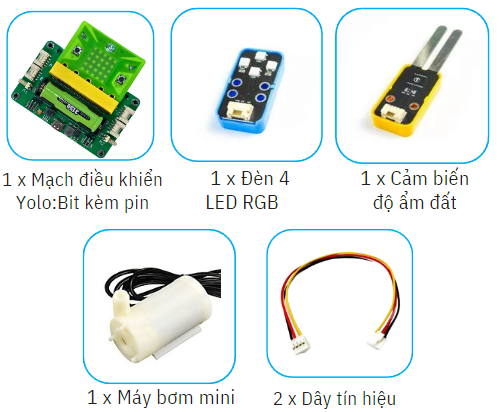
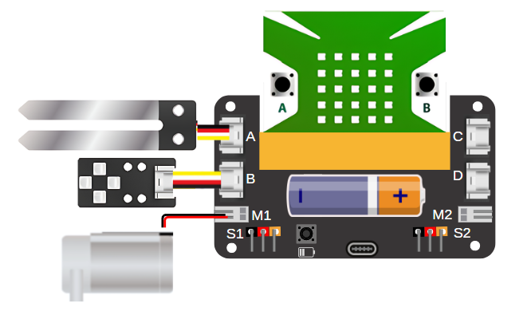
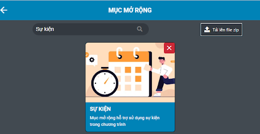
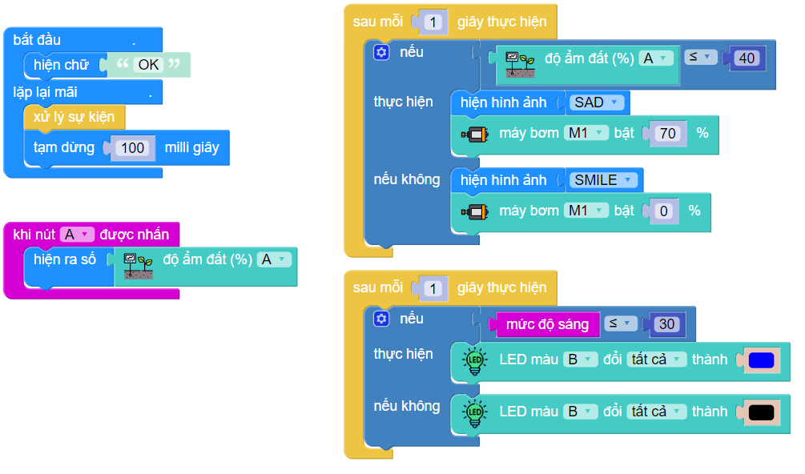

11. Chậu cây thông minh
=========

1. Giới thiệu
-----
-----------

Trong dự án này, học sinh được chế tạo một thiết bị tưới cây thông minh bằng cách dùng cảm biến độ ẩm đất, thiết bị sẽ tự động tưới cây khi đất quá khô và bật đèn khi không đủ ánh sáng. 

Các kiến thức và kỹ năng đạt được trong dự án này như sau: 

..  csv-table:: 
    :widths: 15, 45

    "**Khoa học & Toán học**", "- Vai trò quan trọng của nước với sự sinh trưởng và phát triển của thực vật.
    - Tưới tiêu đúng cách
    - Lập trình điều khiển các thiết bị hoạt động"
    "**Công nghệ**", "Mạch điện điều khiển động cơ bơm nước, cảm biến độ ẩm đất"
    "**Kỹ thuật**", "Đọc hướng dẫn lắp ráp, hoàn thiện mô hình"
    "**Nghệ thuật**", "Mô hình bắt mắt, trang trí và tô màu"
    "**Kỹ năng**", "Thuyết trình, kỹ năng thiết kế theo quy trình TK kỹ thuật, KN sử dụng các công cụ cầm tay: kéo, súng bắn keo …."

2. Hướng dẫn lắp ráp
----
--------

- **Chuẩn bị**: 

|

- **Hướng dẫn lắp ráp**:

    **Đang cập nhật**

- **Kết nối dây**:

    + Cảm biến độ ẩm đất kết nối vào cổng A
    + Đèn LED RGB kết nối vào cổng B
    + Máy bơm mini kết nối vào cổng M1

|

3. Hướng dẫn lập trình
--------
--------

1. Vào mục **Mở rộng** và tải thư viện **Sự kiện**: 

|

2. Viết chương trình như sau: 

|

**Link chương trình:** `<https://app.ohstem.vn/#!/share/yolobit/2dtPSBZh4o8uJNol6yGziL6ltdL>`_

.. note:: 

    Chương trình sẽ thực hiện sự kiện kiểm tra độ ẩm của cây và ánh sáng môi trường sau mỗi 1 giây: 
    
    - Nếu độ ẩm đất dưới 40% thì sẽ hiện hình ảnh SAD và bật máy bơm ở mức 70%. Ngược lại, đất đủ độ ẩm thì hiện Smile và tắt máy bơm, máy bơm hoạt động ở mức 0%. 

    - Nếu độ sáng môi trường dưới 30 thì sẽ bật đèn LED chiếu sáng cho cây. Ngược lại, tắt đèn.

