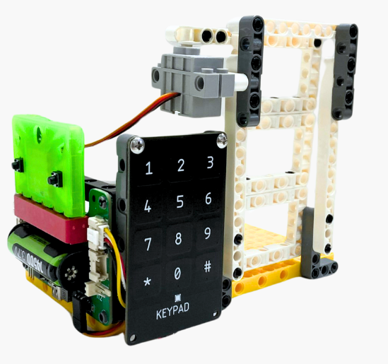
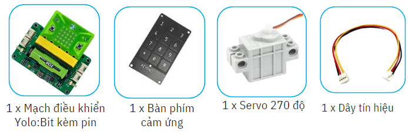
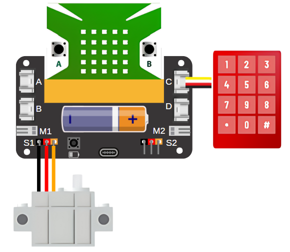
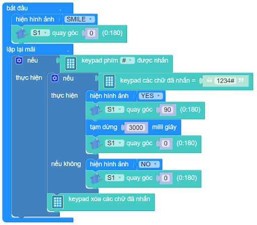

10. Cánh cửa thông minh
=========

1. Giới thiệu
-----
-----------

Với hướng dẫn này, học sinh được thực hành hoàn thiện mô hình cánh cửa thông minh với tính năng bảo mật cao chỉ mở được cửa khi nhập chính xác mật khẩu. 

|

Các kiến thức và kỹ năng đạt được trong dự án này như sau: 

..  csv-table:: 
    :widths: 15, 45

    "**Khoa học & Toán học**", "- Tìm hiểu nguyên lý hoạt động của cửa thông minh
    - Lập trình Yolo:Bit điều khiển các thiết bị hoạt động"
    "**Công nghệ**", "Bàn phím cảm ứng, động cơ servo"
    "**Kỹ thuật**", "Đọc hướng dẫn lắp ráp, hoàn thiện mô hình"
    "**Nghệ thuật**", "Mô hình bắt mắt, trang trí và tô màu"
    "**Kỹ năng**", "Thuyết trình, làm việc nhóm, giải quyết vấn đề"

2. Hướng dẫn lắp ráp
----
--------

- **Chuẩn bị**: 

|

- **Hướng dẫn lắp ráp**:

    **Đang cập nhật**

- **Kết nối dây**:

    + Bàn phím cảm ứng kết nối vào cổng C
    + Động cơ servo vào cổng S1

|

3. Hướng dẫn lập trình
--------
--------

Viết chương trình như sau: 

|

Bạn hãy nhập mật khẩu **“1234”** từ bàn phím và nhấn **“#”** để kết thúc, quan sát kết quả. Lúc này, cửa sẽ mở, Yolo:Bit sẽ hiển thị hình ảnh Yes 

**Link chương trình:** `<https://app.ohstem.vn/#!/share/yolobit/2dtaHeRhHdf2wfwrJUT7ya2Nan0>`_

.. note:: Chương trình sẽ thực hiện như sau: 

    Ngay khi bắt đầu chương trình, cửa sẽ ở trạng thái đóng vì thế chúng ta cho servo quay ở góc 0 độ.
    
    Sau đó, kiểm tra kết quả đã nhập bằng phím “#”:

        + Nếu kết quả đã nhập là “1234” thì sẽ hiển thị Yes và mở cửa trong 3 giây. Tức là, servo sẽ quay đến góc 90 độ, dừng trong 3 giây và quay lại góc 0 độ để đóng cửa. 
        + Nếu không, thì hiện thị No và không mở cửa. 

    Sau khi thực hiện việc kiểm tra, các phím vừa được nhấn sẽ được xóa đi. 
