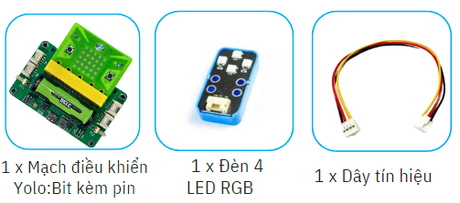
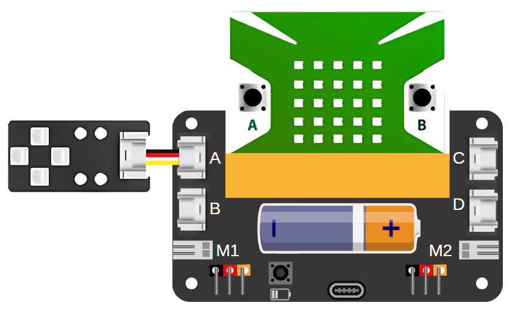
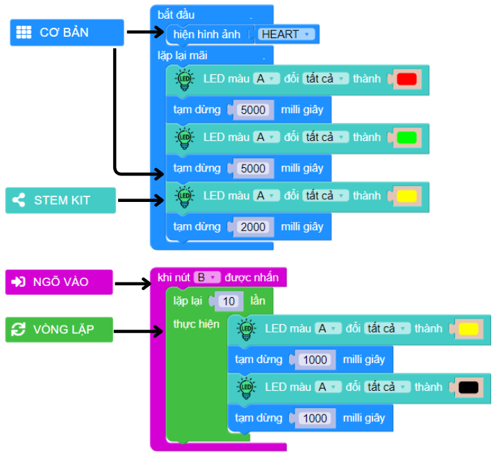

3. Đèn giao thông
=========

1. Giới thiệu
-----
-----------

Trong dự án này, học sinh sẽ được sáng tạo một mô hình mô phỏng đèn giao thông thông minh, có thể bật đèn đỏ, xanh, vàng để điều tiết giao thông vào các thời điểm đông xe. Nhưng cũng có thể chuyển sang chế độ nhấp nháy đèn vàng để báo hiệu các xe di chuyển chậm vào ban đêm.

Các kiến thức và kỹ năng đạt được trong dự án này như sau: 

..  csv-table:: 
    :widths: 15, 45

    "**Khoa học & Toán học**", "- Tại sao đèn giao thông sử dụng các màu đỏ, vàng và xanh lá? 
    - Tìm hiểu nguyên lý hoạt động của đèn
    - Lập trình các thiết bị hoạt động tự động
    - Tính toán thời gian hoạt động của đèn"
    "**Công nghệ**", "Module đèn 4 LED RGB"
    "**Kỹ thuật**", "Đọc hướng dẫn lắp ráp, hoàn thiện mô hình"
    "**Nghệ thuật**", "Mô hình bắt mắt, trang trí và tô màu"
    "**Kỹ năng**", "Thuyết trình, làm việc nhóm, giải quyết vấn đề"

2. Hướng dẫn lắp ráp
----
--------

- **Chuẩn bị**: 

|

- **Hướng dẫn lắp ráp**:

.. raw:: html

    <iframe width="560" height="315" src="https://www.youtube.com/embed/sK4Ib5xUD10?si=zzuFCptgfcPJOaJ7" title="YouTube video player" frameborder="0" allow="accelerometer; autoplay; clipboard-write; encrypted-media; gyroscope; picture-in-picture; web-share" allowfullscreen></iframe>
|

- **Kết nối dây**:

    Đèn LED RGB kết nối vào cổng A

|

3. Hướng dẫn lập trình
--------
--------

Viết chương trình như sau: 

|

**Link chương trình:** `<https://app.ohstem.vn/#!/share/yolobit/2di2fCMnQc0ZWbJjoMXcCpPlgWc>`_

.. note:: 

    - Trong khối lệnh điều khiển đèn LED, bạn có thể chọn màu hiển thị. 
    - Đèn LED sẽ đổi màu theo thứ tự đèn đỏ 5 giây, đèn xanh 5 giây và đèn vàng 2 giây. 
    - Khi nút B được nhấn, đèn vàng sẽ chớp tắt đèn vàng 10 lần và trở lại chức năng đèn giao thông mặc định.
