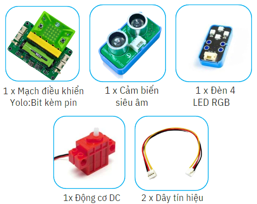

8. Đèn học thông minh
=========

1. Giới thiệu
-----
-----------

Với dự án này, học sinh được tìm hiểu về các khó khăn và bất tiện khi sử dụng một chiếc đèn học thông thường. Chẳng hạn như quên tắt đèn sau khi rời bàn học gây lãng phí điện… 

Vì thế, để thuận tiện trong việc học, học sinh sẽ sáng tạo bên một mô hình đèn học thông minh, sẽ tự động bật đèn khi có người ngồi vào bàn học và tích hợp thêm một chiếc quạt máy hoạt động tương tự đèn và có thể thay đổi tốc độ quạt. 

|

Các kiến thức và kỹ năng đạt được trong dự án này như sau: 

..  csv-table:: 
    :widths: 15, 45

    "**Khoa học & Toán học**", "- Tìm hiểu nguyên lý hoạt của mô hình Đèn học thông minh
    - Tính khoảng cách cảm biến phát hiện có người để bật đèn và quạt
    - Lập trình điều khiển các thiết bị"
    "**Công nghệ**", "Đèn LED RGB, cảm biến siêu âm, động cơ DC"
    "**Kỹ thuật**", "Đọc hướng dẫn lắp ráp, hoàn thiện mô hình"
    "**Nghệ thuật**", "Mô hình bắt mắt, trang trí và tô màu"
    "**Kỹ năng**", "Thuyết trình, làm việc nhóm, giải quyết vấn đề"

2. Hướng dẫn lắp ráp
----
--------

- **Chuẩn bị**: 

|

- **Hướng dẫn lắp ráp**:

    **Đang cập nhật**

- **Kết nối dây**:

    + Cảm biến khoảng cách vào cổng A
    + Đèn LED RGB vào cổng B
    + Động cơ DC vào cổng M1

|

3. Hướng dẫn lập trình
--------
--------

Viết chương trình như sau: 

|

**Link chương trình:** `<https://app.ohstem.vn/#!/share/yolobit/2dqOrLCSMjQTTtRYC2UNuUu68Gn>`_

.. note:: 

    Nếu cảm biến khoảng cách phát hiện vật cản trong phạm vi 20cm thì đèn sẽ bật màu trắng, đồng thời quạt sẽ quay ở tốc độ 50. Nếu không, quạt dừng hoạt động và đèn tắt (chuyển đèn sang màu đen). 
    
    Ngoài ra, có thể thay đổi tốc độ của quạt, bằng cách nhấn nút trên mạch Yolo:Bit: 
    
    + Nút A, giảm tốc độ xuống còn 30. 
    + Nút B, tăng tốc độ lên 100, tốc độ tối đa. 
    + Nút A + B, tắt quạt, tốc độ 0.
