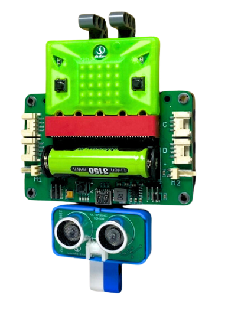
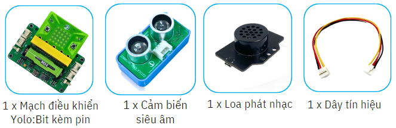
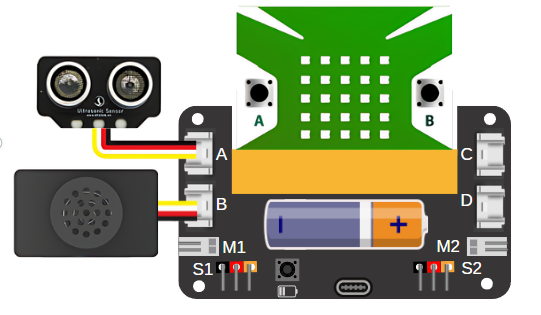
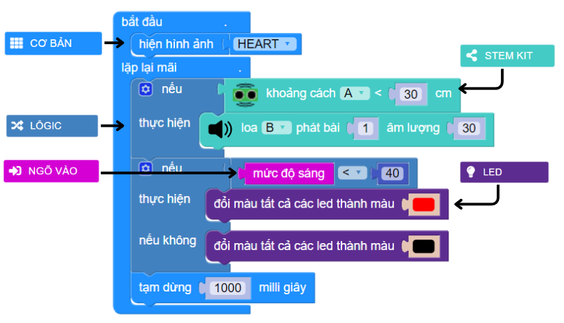

6. Gậy thông minh cho người khiếm thị
=========

1. Giới thiệu
-----
-----------

Với dự án này, học sinh sẽ được tìm hiểu về các sự khó khăn, bất tiện khi phải dò đường và tránh các vật cản trong cuộc sống hằng ngày của người khiếm thị. Vì vậy, chỉ với Yolo:Bit, cảm biến khoảng cách và một chiếc loa mini, học sinh sẽ thiết kế ra một chiếc gậy thông minh, khi có khả năng phát hiện và cảnh báo khi người dùng đi lại gần vật cản. Đồng thời, sẽ bật đèn cảnh báo khi đêm xuống giúp người xung quanh có thể quan sát và tránh va chạm. 

|

Các kiến thức và kỹ năng đạt được trong dự án này như sau: 

..  csv-table:: 
    :widths: 15, 45

    "**Khoa học & Toán học**", "- Các khó khăn và sự bất tiện của người khiếm thị
    - Nêu được các ý tưởng giúp đỡ người khiếm thị
    - Nguyên lý hoạt động của cảm biến siêu âm và chiếc gậy thông minh
    - Tính toán khoảng cách để chiếc gậy có thể phát hiện vật cản kịp thời
    - Lập trình điều khiển các thiết bị hoạt động"
    "**Công nghệ**", "Cảm biến siêu âm, Module phát nhạc"
    "**Kỹ thuật**", "Đọc hướng dẫn lắp ráp, hoàn thiện mô hình"
    "**Nghệ thuật**", "Mô hình bắt mắt, trang trí và tô màu"
    "**Kỹ năng**", "Thuyết trình, làm việc nhóm, giải quyết vấn đề"

2. Hướng dẫn lắp ráp
----
--------

- **Chuẩn bị**: 

|

- **Hướng dẫn lắp ráp**:

    **Đang cập nhật**

- **Kết nối dây**:

    + Cảm biến khoảng cách vào cổng A
    + Module phát nhạc cổng B

|

3. Hướng dẫn lập trình
--------
--------

Viết chương trình như sau: 

|

**Link chương trình:** `<https://app.ohstem.vn/#!/share/yolobit/2didfFNQeo7wvZywCyd8pRdbBAm>`_

.. note:: 

    Khi cảm biến khoảng cách trên gậy thông minh phát hiện vật cản trong phạm vi 30cm thì bật loa phát bài nhạc số 1. Đồng thời, nếu phát hiện trời tối, gậy thông minh bật đèn đỏ, giúp cảnh báo cho những người xung quanh. 

   **Để thay đổi âm thanh cho loa phát nhạc, bạn có thể xem mục 6** `tại đây <https://docs.ohstem.vn/en/latest/module/dieu-khien-dong-ngat/nhac.html>`_
