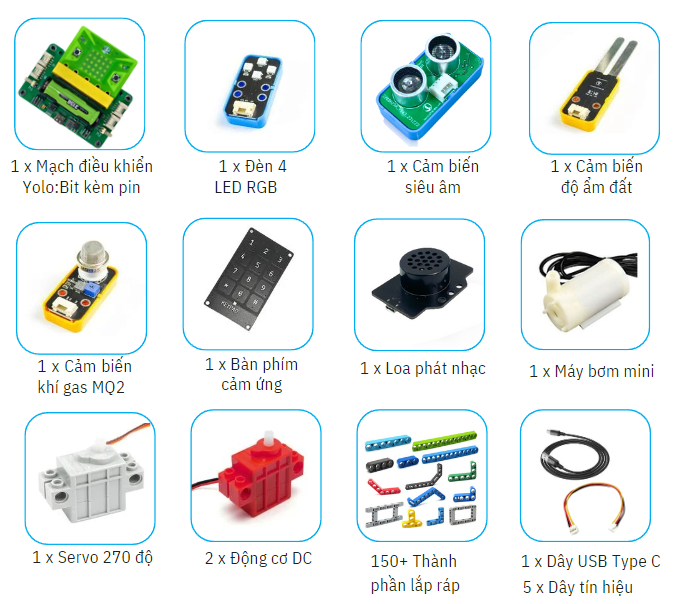

1. Giới thiệu về Stem Starter Kit
========

1. Giới thiệu 
---------
----------

STEM Starter Kit là một bộ công cụ cơ bản được thiết kế để giúp các học sinh cấp tiểu học, từ 7 đến 12 tuổi tiếp cận với các dự án STEM đơn giản. Bộ Kit này không chỉ hỗ trợ trong việc áp dụng kiến thức STEM vào các môn học như Toán học, Vật lý và Công nghệ… mà còn là một lựa chọn lý tưởng cho việc tổ chức các buổi trải nghiệm STEM đầy thú vị.

Với khả năng mở rộng, bộ Kit thực hiện được nhiều chủ đề STEM khác nhau. Điều này tạo ra một môi trường sinh hoạt sôi nổi cho học sinh khám phá và phát triển kỹ năng STEM của mình.

2. Các chủ đề của bộ Kit
-----------
---------

Các chủ đề STEM được chia thành các nhóm chủ đề như sau: 

..  csv-table:: 
    :header: "STT", "Tên chủ đề"
    :widths: 10, 45

    "", "**Nhóm chủ đề Sáng tạo**"
    1, "Đèn giao thông"
    2, "Máy rửa tay không chạm"
    3, "Bãi đậu xe thông minh"
    4, "Gậy thông minh cho người kiếm thị"
    5, "Máy cảnh báo khí gas"
    "", "**Nhóm chủ đề Nhà thông minh**"
    6, "Đèn học thông minh"
    7, "Thùng rác thông minh"
    8, "Cánh cửa thông minh"
    9, "Chậu cây thông minh"
    "", "**Nhóm chủ đề Trò chơi**"
    10, "Trò chơi luồn dây"
    11, "Vòng quay may mắn"
    12, "Máy bắn đá"
    "", "**Nhóm chủ đề Robotics**"
    13, "Cáp treo"
    14, "Cuộc đua robot cào cào"
    15, "Robot vận chuyển"
    16, "Robot né vật cản"
    17, "Robot gắp vật"
    18, "Thuyền điện"
    "", "**Nhóm chủ đề Ngày lễ**"
    21, "Cây thông Noel"
    22, "Robot gói bánh chưng"
    23, "Bí ngô Halloween"
    "", "**Nhóm chủ đề Thí nghiệm khoa học**"
    24, "Điện gió"
    25, "Đo ánh sáng "

3. Thành phần bộ Kit
-----------
---------

