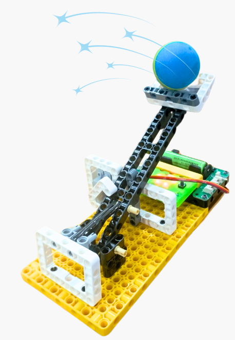
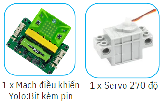
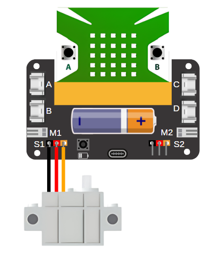
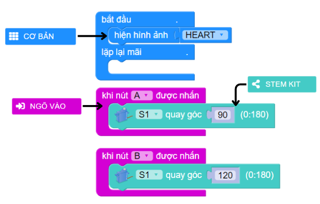

14. Máy bắn đá
=========

1. Giới thiệu
-----
-----------

Trong dự án này, học sinh sẽ tham gia vào việc tạo ra một mô hình máy bắn đá, tương tự như loại vũ khí được sử dụng trong các cuộc chiến trong thời cổ đại. Mục tiêu của dự án là giúp học sinh áp dụng kiến thức về góc và điều chỉnh góc bắn để có thể đánh đổ một bức tường được làm bằng giấy.

|

Các kiến thức và kỹ năng đạt được trong dự án này như sau: 

..  csv-table:: 
    :widths: 15, 45

    "**Khoa học & Toán học**", "- Tìm hiểu các bộ phận, công dụng, chức năng của máy bắn đá trong lịch sử
    - Nguyên lý hoạt động của máy bắn đá
    - Tính toán, tinh chỉnh các góc bắn
    - Lập trình điều khiển góc của cần gạt trên máy bắn đá"
    "**Công nghệ**", "Động cơ servo"
    "**Kỹ thuật**", "Thiết kế, sáng tạo, hoàn thiện mô hình"
    "**Nghệ thuật**", "Mô hình bắt mắt, trang trí và tô màu"
    "**Kỹ năng**", "Kỹ năng thiết kế theo quy trình TK kỹ thuật"

2. Hướng dẫn lắp ráp
----
--------

- **Chuẩn bị**: 

|

- **Hướng dẫn lắp ráp**:

    **Đang cập nhật**

- **Kết nối dây**:

    + Kết nối động cơ servo vào cổng S1

|

3. Hướng dẫn lập trình
--------
--------

Viết chương trình như sau: 

|

**Link chương trình:** `<https://app.ohstem.vn/#!/share/yolobit/2dqlwvBBThLRYnUYESNQFh5Drbf>`_

.. note:: Chương trình sẽ thực hiện như sau: 

    Servo được dùng để làm cần gạt, khi nhấn nút A servo sẽ lên chốt gài thanh bắn. Khi nhấn nút B, cần gạt bật ra ngoài, lúc này thanh bắn được tung lên, đẩy đá bắn về phía trước. 
    
    Sau khi bắn xong, bạn cần dùng tay để gạt thanh bắn về vị trí ban đầu và nhấn nút A để gài lại thanh bắn. 

