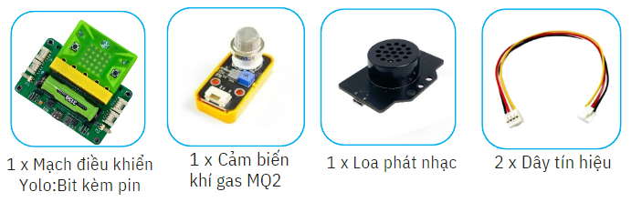
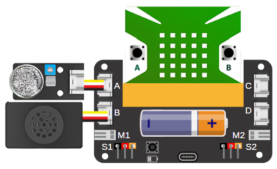
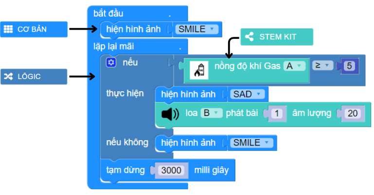

7. Máy cảnh báo khí gas
=========

1. Giới thiệu
-----
-----------

Với dự án này, học sinh được tìm hiểu về các vấn đề và bất cập thường xảy ra khi sử dụng gas trong gia đình, giúp học sinh hiểu được các nguyên nhân gây cháy nổ. Từ đó, học sinh tự tay thiết kế và làm ra một mô hình máy cảnh báo khí gas. 

Khi phát hiện sự rò rĩ gas, âm thanh từ loa mini sẽ phát ra cảnh báo

Các kiến thức và kỹ năng đạt được trong dự án này như sau: 

..  csv-table:: 
    :widths: 15, 45

    "**Khoa học & Toán học**", "- Nguyên nhân gây cháy nổi
    - Các vấn đề thường gặp khi dùng gas trong gia đình. 
    - Nguyên lý hoạt động của cảm biến khí gas
    - Lập trình Yolo:Bit cảnh báo khi phát hiện rò rỉ gas"
    "**Công nghệ**", "Cảm biến khí gas MQ2, Module phát nhạc"
    "**Kỹ thuật**", "Đọc hướng dẫn lắp ráp, hoàn thiện mô hình"
    "**Nghệ thuật**", "Mô hình bắt mắt, trang trí và tô màu"
    "**Kỹ năng**", "Thuyết trình, làm việc nhóm, giải quyết vấn đề"

2. Hướng dẫn lắp ráp
----
--------

- **Chuẩn bị**: 

|

- **Hướng dẫn lắp ráp**:

    **Đang cập nhật**

- **Kết nối dây**:

    + Cảm biến khí gas vào cổng A
    + Module phát nhạc cổng B

|

3. Hướng dẫn lập trình
--------
--------

Viết chương trình như sau: 

|

**Link chương trình:** `<https://app.ohstem.vn/#!/share/yolobit/2dz0CY1NN6OxQQ7ThyPhIl9TvVe>`_

.. note:: 

    Khi cảm biến phát hiện lượng gas trong không khí lớn hơn 5 thì sẽ hiển thị hình ảnh SAD và bật âm thanh cảnh báo, ngược lại thì hiện hình ảnh Smile. Sau mỗi 3 giây, hệ thống sẽ kiểm tra nồng độ khí gas 1 lần.

   **Để thay đổi âm thanh cho loa phát nhạc, bạn có thể xem mục 6** `tại đây <https://docs.ohstem.vn/en/latest/module/dieu-khien-dong-ngat/nhac.html>`_
