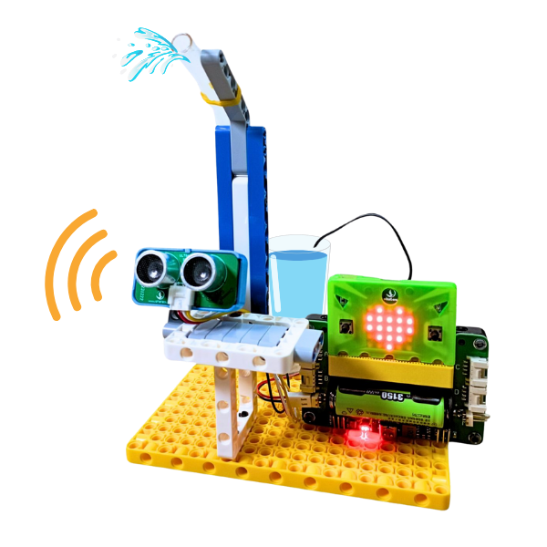

4. Máy rửa tay không chạm
=========

1. Giới thiệu
-----
-----------

Trong dự án này, học sinh được làm quen với một hệ thống tự động cơ bản là máy rửa tay không chạm, hệ thống chỉ cần phát hiện tay người vòi nước sẽ tự bật.

|

Các kiến thức và kỹ năng đạt được trong dự án này như sau: 

..  csv-table:: 
    :widths: 15, 45

    "**Khoa học & Toán học**", "- Lợi ích của việc tiết kiệm nước
    - Tìm hiểu cách hoạt động máy rửa tay không chạm
    - Nguyên lý hoạt động của cảm biến siêu âm
    - Lập trình các thiết bị hoạt động"
    "**Công nghệ**", "Máy bơm mini, cảm biến siêu âm"
    "**Kỹ thuật**", "Đọc hướng dẫn lắp ráp, hoàn thiện mô hình"
    "**Nghệ thuật**", "Mô hình bắt mắt, trang trí và tô màu"
    "**Kỹ năng**", "Thuyết trình, làm việc nhóm, giải quyết vấn đề"

2. Hướng dẫn lắp ráp
----
--------

- **Chuẩn bị**: 

|

- **Hướng dẫn lắp ráp**:

    **Đang cập nhật**

- **Kết nối dây**:

    + Cảm biến khoảng cách vào cổng A
    + Máy bơm mini vào cổng động cơ M1

|

3. Hướng dẫn lập trình
--------
--------

Viết chương trình như sau: 

|

**Link chương trình:** `<https://app.ohstem.vn/#!/share/yolobit/2di49zWzULHpcglYL6F0sV9JoRb>`_

.. note:: 
    Chương trình được thực hiện như sau: 

    Nếu cảm biến khoảng cách phát hiện vật cản ở phạm vi nhỏ hơn 15cm, thì bật máy bơm ở mức 70%. Ngược lại, tắt máy bơm, tức là máy bơm bật ở mức 0%. 

    **Lưu ý:** Bạn cần đặt thêm câu lệnh tắt máy bơm trong phần bắt đầu để hạn chế việc máy bơm hoạt động ngay khi vừa bật nguồn. 
