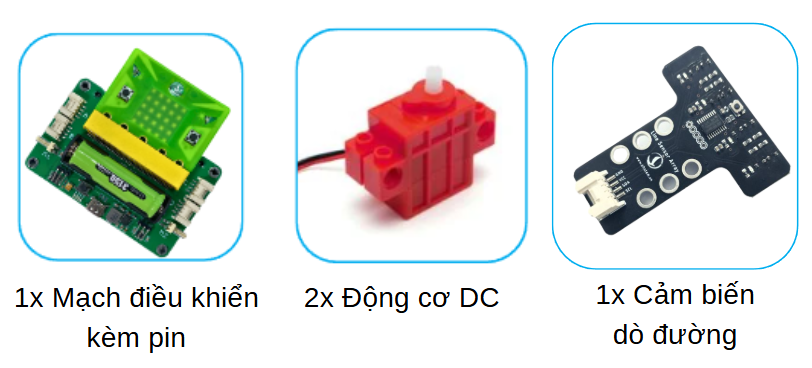
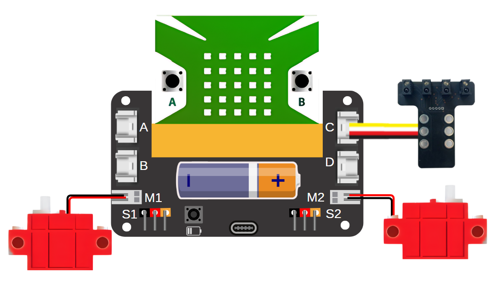
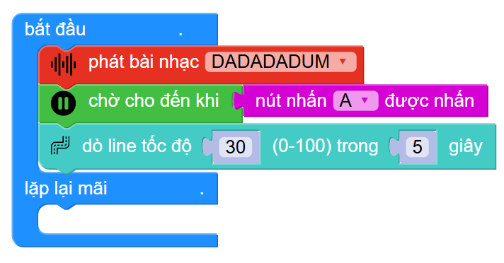

23. Robot dò đường 
=========

1. Giới thiệu
-----
-----------

Với chủ đề này, học sinh sẽ được tự tay lắp ráp và lập trình để hoàn thành mô hình robot có khả năng di chuyển theo đường kẻ màu đen.

Các kiến thức và kỹ năng đạt được trong dự án này như sau: 

..  csv-table:: 
    :widths: 15, 45

    "**Khoa học & Toán học**", "- Tìm hiểu ứng dụng và nguyên lý hoạt động của robot dò đường
    - Tính toán tốc độ di chuyển của robot
    "**Công nghệ**", "Động cơ DC, cảm biến dò đường"
    "**Kỹ thuật**", "Thiết kế, sáng tạo, hoàn thiện mô hình"
    "**Nghệ thuật**", "Mô hình bắt mắt, trang trí và tô màu"
    "**Kỹ năng**", "Kỹ năng thiết kế theo quy trình TK kỹ thuật"

2. Hướng dẫn lắp ráp
----
--------

- **Chuẩn bị**: 

|

- **Hướng dẫn lắp ráp**:

.. raw:: html

    <iframe width="560" height="315" src="https://www.youtube.com/embed/-hazpX-ZC24?si=iCizJpo50FmPn3fX" title="YouTube video player" frameborder="0" allow="accelerometer; autoplay; clipboard-write; encrypted-media; gyroscope; picture-in-picture; web-share" referrerpolicy="strict-origin-when-cross-origin" allowfullscreen></iframe>
|

- **Kết nối dây**:

    + Kết nối 2 động cơ DC vào cổng M1 và M2
    + Kết nối cảm biến dò đường vào cổng C

|

3. Hướng dẫn lập trình
--------
--------

1. Viết chương trình như sau:

    Link chương trình: `<https://app.ohstem.vn/#!/share/yolobit/2qjuVEGt2VeFtzkjWuPuRGRys6j>`_

2. Sau khi gửi chương trình xuống Yolo:Bit, đặt robot lên bản đồ dò line như hướng dẫn lắp ráp và nhấn nút A để robot di chuyển theo đường line.

