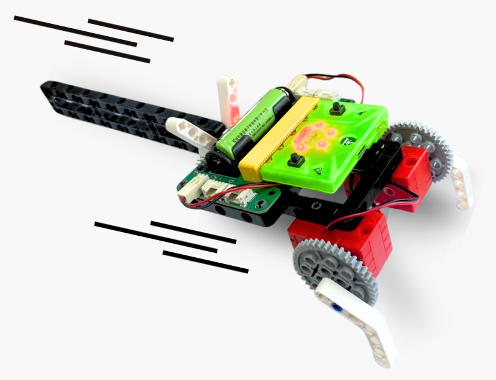
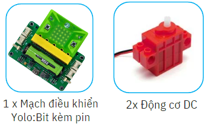
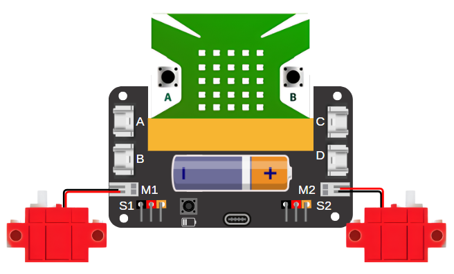
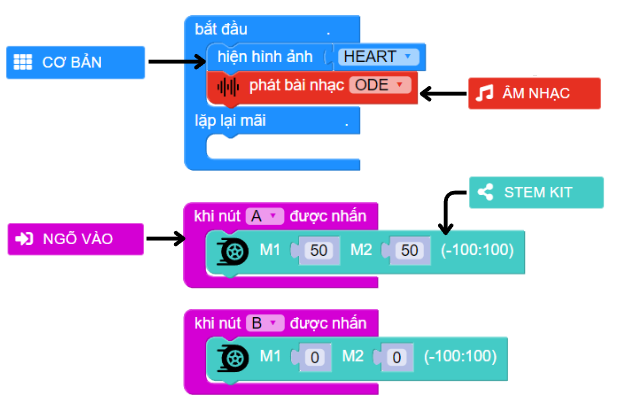

16. Cuộc đua robot cào cào
=========

1. Giới thiệu
-----
-----------

Học sinh được hoàn thiện mô hình robot cào cào, làm thế nào để tối ưu được khả năng di chuyển và tham gia cuộc đua robot để tìm ra chú robot di chuyển nhanh nhất. 

|

Các kiến thức và kỹ năng đạt được trong dự án này như sau: 

..  csv-table:: 
    :widths: 15, 45

    "**Khoa học & Toán học**", "- Tìm hiểu về lực đẩy và lực ma sát
    - Phân tích các yếu tổ ảnh hưởng đến việc di chuyển của robot
    - Tính toán kích thước các bộ phận của robot để đạt kết quả tốt nhất
    - Lập trình điều khiển robot di chuyển"
    "**Công nghệ**", "Động cơ DC"
    "**Kỹ thuật**", "Thiết kế, sáng tạo, hoàn thiện mô hình"
    "**Nghệ thuật**", "Mô hình bắt mắt, trang trí và tô màu"
    "**Kỹ năng**", "Kỹ năng thiết kế theo quy trình TK kỹ thuật"

2. Hướng dẫn lắp ráp
----
--------

- **Chuẩn bị**: 

|

- **Hướng dẫn lắp ráp**:

    **Đang cập nhật**

- **Kết nối dây**:

    + Kết nối 2 động cơ DC vào cổng M1 và M2

|

3. Hướng dẫn lập trình
--------
--------

Viết chương trình như sau: 

|

**Link chương trình:** `<https://app.ohstem.vn/#!/share/yolobit/2dqor30Np2rzQjYfCzGu8wu2njq>`_

.. note:: Chương trình sẽ thực hiện như sau: 

    - Khi nhấn nút A, robot sẽ di chuyển, tức là động cơ M1 và M2 cùng hoạt động ở tốc độ 50. 
    - Khi nhấn nút B, robot dừng di chuyển, tức động cơ hoạt động ở tốc độ 0. 

