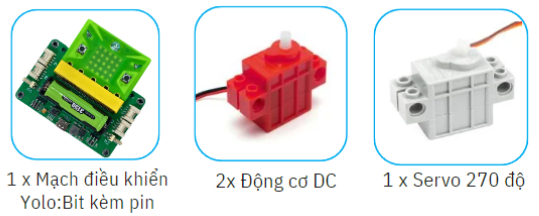

19. Robot gắp vật
=========

1. Giới thiệu
-----
-----------

Với hoạt động này, học sinh được tìm hiểu về việc robot hỗ trợ con người trong các công việc nguy hiểm, nặng nhọc. Vận dụng lập trình robot  và thi đua gắp các khối vật vào vị trí thích hợp.

Các kiến thức và kỹ năng đạt được trong dự án này như sau: 

..  csv-table:: 
    :widths: 15, 45

    "**Khoa học & Toán học**", "- Chức năng của robot trong các lĩnh vực
    - Cách hoạt động của tay gắp
    - Lập trình điều khiển robot và tay gắp."
    "**Công nghệ**", "Động cơ DC, cảm biến siêu âm, động cơ servo"
    "**Kỹ thuật**", "Thiết kế, sáng tạo, hoàn thiện mô hình"
    "**Nghệ thuật**", "Mô hình bắt mắt, trang trí và tô màu"
    "**Kỹ năng**", "Kỹ năng thiết kế theo quy trình TK kỹ thuật"

2. Hướng dẫn lắp ráp
----
--------

- **Chuẩn bị**: 

|

- **Hướng dẫn lắp ráp**:

    **Đang cập nhật**

- **Kết nối dây**:

    + Kết nối 2 động cơ DC vào cổng M1 và M2
    + Kết nối động cơ servo vào cổng S1

|

3. Hướng dẫn lập trình
--------
--------

1. Viết chương trình như sau:

**Chương trình đang được cập nhật**

2. Sau khi gửi chương trình xuống Yolo:Bit, bạn thoát khỏi chế độ lập trình, ở về màn hình chính của Yolo:Bit và chọn **Điều khiển**. 

.. image:: images/robot_van_chuyen_3.png
    :scale: 90%
    :align: center 
|

3. Lúc này, giao diện hiển thị như hình dưới, kết nối Bluetooth với Yolo:Bit và nhấn nút điều khiển di chuyển. 

.. image:: images/robot_van_chuyen_4.png
    :scale: 90%
    :align: center 
|

Nhấn các nút A, D để điều khiển tay gắp. A để đóng tay gắp, D để mở tay gắp

