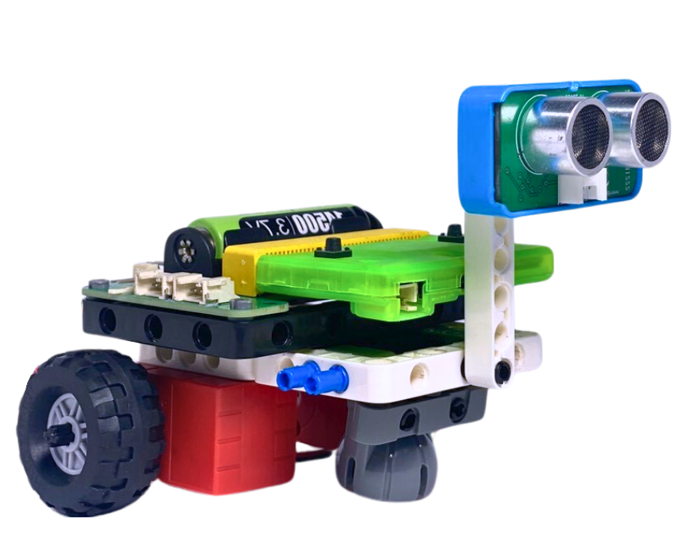
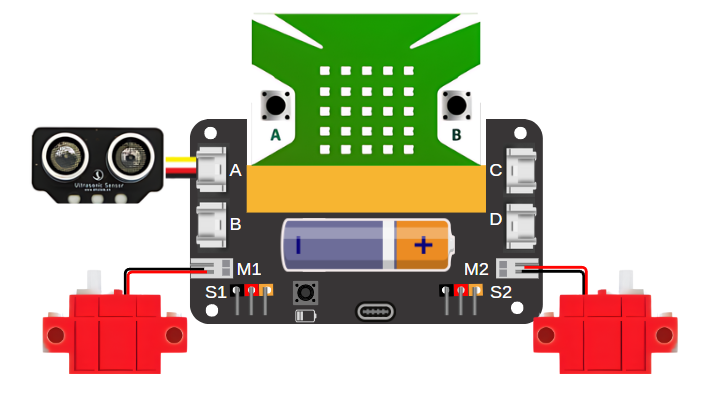
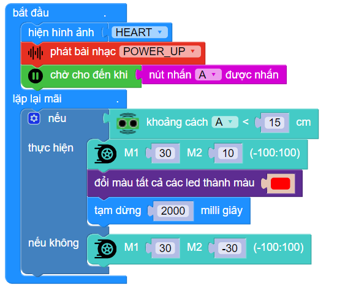

18. Robot né vật
=========

1. Giới thiệu
-----
-----------

Với chủ đề này, học sinh được tìm hiểu về công dụng và chức năng của các loại robot. Tìm hiểu về nguyên lý hoạt động của robot né vật cản và ứng dụng vào thực tế. 

|

Các kiến thức và kỹ năng đạt được trong dự án này như sau: 

..  csv-table:: 
    :widths: 15, 45

    "**Khoa học & Toán học**", "- Tìm hiểu các loại robot trong thực tế
    - Chức năng của các loại robot
    - Nguyên lý hoạt động của robot né vật cản
    - Nguyên lý hoạt động của cảm biến siêu âm
    - Tính toán phạm vi phát hiện vật cản
    - Lập trình robot phát hiện vật cản tự động"
    "**Công nghệ**", "Động cơ DC, cảm biến siêu âm"
    "**Kỹ thuật**", "Thiết kế, sáng tạo, hoàn thiện mô hình"
    "**Nghệ thuật**", "Mô hình bắt mắt, trang trí và tô màu"
    "**Kỹ năng**", "Kỹ năng thiết kế theo quy trình TK kỹ thuật"

2. Hướng dẫn lắp ráp
----
--------

- **Chuẩn bị**: 

|

- **Hướng dẫn lắp ráp**:

.. raw:: html

    <iframe width="560" height="315" src="https://www.youtube.com/embed/fY91f03LtVI?si=1LBFSq1pWnzEuLZ4" title="YouTube video player" frameborder="0" allow="accelerometer; autoplay; clipboard-write; encrypted-media; gyroscope; picture-in-picture; web-share" referrerpolicy="strict-origin-when-cross-origin" allowfullscreen></iframe>
|

- **Kết nối dây**:

    + Kết nối 2 động cơ DC vào cổng M1 và M2
    + Kết nối cảm biến siêu âm vào cổng A

|

3. Hướng dẫn lập trình
--------
--------

Viết chương trình như sau:

|

**Link chương trình:** `<https://app.ohstem.vn/#!/share/yolobit/2gokDijH100ezfzV0Pvfr9bTSNj>`_

.. note:: Chương trình sẽ thực hiện như sau: 

    Khi bắt đầu, robot sẽ di chuyển về phía trước, khi gặp vật cản, robot sẽ bật đèn đỏ cảnh báo và rẽ phải.

