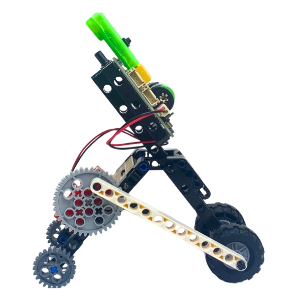
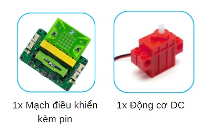
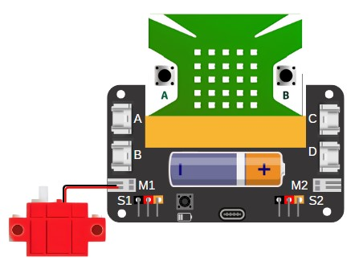
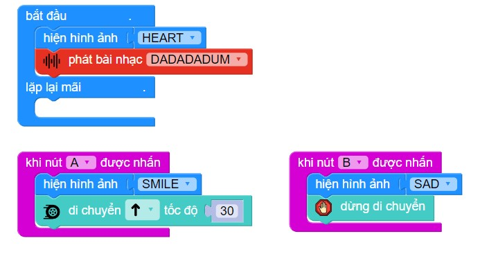

21. Robot sâu đo
=========

1. Giới thiệu
-----
-----------

Với chủ đề này, học sinh tìm hiểu về chuyển động của sâu đo và cơ chế vận hành. 70% thời gian sẽ dùng để thực hiện mô hình và thi đấu tìm ra robot di chuyển nhanh nhất.

|

Các kiến thức và kỹ năng đạt được trong dự án này như sau: 

..  csv-table:: 
    :widths: 15, 45

    "**Khoa học & Toán học**", "- Tìm hiểu về cách chuyển động của các loại robot 
    - Tìm hiểu chuyển động của robot sâu đo và cơ chế vận hành của robot
    - Nguyên lý hoạt động của động cơ DC
    - Lập trình tốc độ và góc di chuyển của robot"
    "**Công nghệ**", "Động cơ servo"
    "**Kỹ thuật**", "Thiết kế và chế tạo một robot sâu đo đơn giản"
    "**Nghệ thuật**", "Mô hình bắt mắt, trang trí và tô màu"
    "**Kỹ năng**", "- Thuyết trình, làm việc nhóm, giải quyết vấn đề"

2. Hướng dẫn lắp ráp
----
--------

- **Chuẩn bị**: 

|

- **Hướng dẫn lắp ráp**: Hình ảnh các hướng lắp ráp của robot sâu đo

.. list-table:: 
   :widths: auto
   :header-rows: 1
     
   * - .. image:: images/robot-sau-do-1.jpg
          :width: 200px
          :align: center
     - .. image:: images/robot-sau-do-2.jpg
          :width: 200px
          :align: center
   * - .. image:: images/robot-sau-do-3.jpg
          :width: 200px
          :align: center
     - .. image:: images/robot-sau-do-2.jpg
          :width: 200px
          :align: center          

- **Kết nối dây**:

    + Kết nối động cơ servo vào cổng M1

|

3. Hướng dẫn lập trình
--------
--------

Viết chương trình như sau: 

|

**Link chương trình:** `<https://app.ohstem.vn/#!/share/yolobit/2iiZPTYgYhFQy5T4tqxnvCsks0w>`_

.. note:: Chương trình sẽ thực hiện như sau: 

    Khi nhấn nút A, robot sẽ di chuyển về phía trước với tốc độ 30. Nhấn nút B, robot sẽ dừng lại.
    Ngoài ra, bạn có thể thay đổi chương trình bằng câu lệnh bên dưới để robot di chuyển trong một khoảng thời gian. 

    .. image:: images/robot-sau-do-8.jpg
        :scale: 80%
        :align: center 
    |

