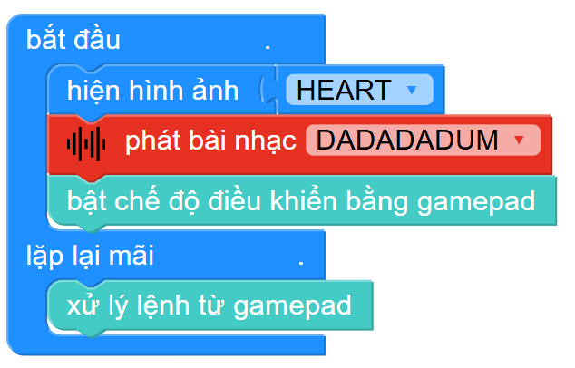

17. Robot điều khiển từ xa
=========

1. Giới thiệu
-----
-----------

Với chủ đề này, học sinh sẽ được tự tay lắp ráp và lập trình để hoàn thành mô hình robot vận chuyển được các khối vật có khả năng điều khiển từ xa bằng điện thoại. 

Các kiến thức và kỹ năng đạt được trong dự án này như sau: 

..  csv-table:: 
    :widths: 15, 45

    "**Khoa học & Toán học**", "- Tìm hiểu ứng dụng và nguyên lý hoạt động của robot 
    - Tìm hiểu cơ cấu truyền động của robot
    - Tính toán tốc độ di chuyển của robot
    - Lập trình điều khiển robot bằng gamepad"
    "**Công nghệ**", "Động cơ DC"
    "**Kỹ thuật**", "Thiết kế, sáng tạo, hoàn thiện mô hình"
    "**Nghệ thuật**", "Mô hình bắt mắt, trang trí và tô màu"
    "**Kỹ năng**", "Kỹ năng thiết kế theo quy trình TK kỹ thuật"

2. Hướng dẫn lắp ráp
----
--------

- **Chuẩn bị**: 

.. image:: images/robot_cao_cao.png
    :scale: 90%
    :align: center 
|

- **Hướng dẫn lắp ráp**:

.. raw:: html

    <iframe width="560" height="315" src="https://www.youtube.com/embed/Hxmi9zXZKUI?si=yWSKz0Y0ncQm6wrJ" title="YouTube video player" frameborder="0" allow="accelerometer; autoplay; clipboard-write; encrypted-media; gyroscope; picture-in-picture; web-share" referrerpolicy="strict-origin-when-cross-origin" allowfullscreen></iframe>
|
- **Kết nối dây**:

    + Kết nối 2 động cơ DC vào cổng M1 và M2

|

3. Hướng dẫn lập trình
--------
--------

1. Viết chương trình như sau:

|

Link chương trình: `<https://app.ohstem.vn/#!/share/yolobit/2tnZsJ714qyllEuGZk3D23EI1IB>`_

2. Sau khi gửi chương trình xuống Yolo:Bit, bạn thoát khỏi chế độ lập trình, ở về màn hình chính của Yolo:Bit và chọn **Điều khiển**. 

|

3. Lúc này, giao diện hiển thị như hình dưới, kết nối Bluetooth với Yolo:Bit và nhấn nút điều khiển di chuyển. 

.. image:: images/robot_van_chuyen_4.png
    :scale: 90%
    :align: center 
|

