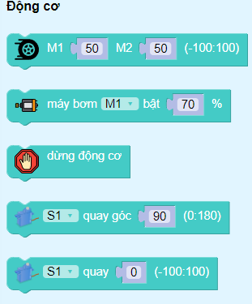

2. Cài đặt thư viện STEM KIT
========

Để lập trình cho Yolo:Bit điều khiển được các thiết bị hoạt động. Chúng ta cần thực hiện các thao tác sau: 

1. Truy cập vào `<https://app.ohstem.vn/>`_  và chọn thiết bị lập trình là **Yolo:Bit**

.. image:: images/app.png
    :scale: 100%
    :align: center 
|

2. Chọn mục **Lập trình**

.. image:: images/app_2.png
    :scale: 100%
    :align: center 
|

3. Trong danh mục khối lệnh, vào mục **MỞ RỘNG** →  Tải thư viện **STEM KIT** như hình: 

|

4. Nhấn vào hình đại diện **STEM KIT** để tải thư viện → Nhấn **OK**. Sau khi tải thành công thư viện, trong danh mục khối lệnh sẽ xuất hiện các khối lệnh như sau:

|

5. Cách lập trình sẽ được hướng dẫn ở mỗi dự án. 

6. **Kết nối:** Từ thanh công cụ của chương trình, bạn chọn vào biểu tượng **Bluetooth** → chọn tên của **Yolo:Bit** → chọn nút **Connect**, khi kết nối thành công, biểu tượng Bluetooth chuyển sang màu xanh dương: 

|

7. **Chạy chương trình**: Bạn chỉ cần nhấn vào biểu tượng **nút** **Play (màu xanh dương)** ở góc bên phải để chạy thử chương trình. Trong trường hợp muốn dừng, bạn nhấn vào nút Stop (màu đỏ) ở bên dưới bên phải màn hình.

