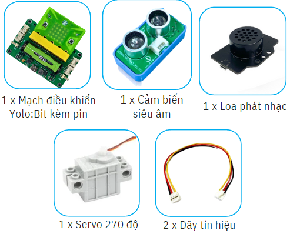
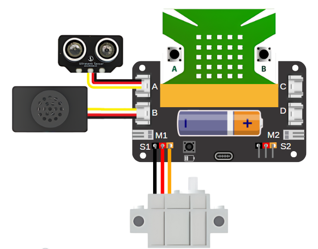
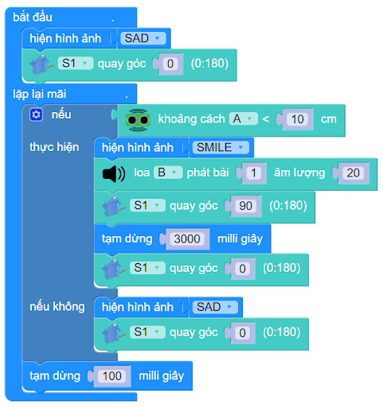

9. Thùng rác thông minh
=========

1. Giới thiệu
-----
-----------

Với dự án này, sẽ xây dựng một thùng rác thông minh, dùng cảm biến siêu âm để nhận biết có người hay không. Khi đó, Yolo:Bit sẽ điều khiển servo đóng/ mở nắp thùng rác tùy trường hợp và loa mini sẽ phát âm thanh báo hiệu.

Các kiến thức và kỹ năng đạt được trong dự án này như sau: 

..  csv-table:: 
    :widths: 15, 45

    "**Khoa học & Toán học**", "- Tìm hiểu về các nguyên nhân gây ô nhiễm môi trường
    - Các biện pháp giảm thiểu tình trạng ô nhiễm môi trường
    - Các vấn đề thường gặp khi sử dụng thùng rác thường. 
    - Tính toán khoảng cách nhận biết khi có người lại gần
    - Lập trình điều khiển các thiết bị hoạt động"
    "**Công nghệ**", "Cảm biến siêu âm, module phát nhạc, động cơ servo"
    "**Kỹ thuật**", "Đọc hướng dẫn lắp ráp, hoàn thiện mô hình"
    "**Nghệ thuật**", "Mô hình bắt mắt, trang trí và tô màu"
    "**Kỹ năng**", "Thuyết trình, làm việc nhóm, giải quyết vấn đề"

2. Hướng dẫn lắp ráp
----
--------

- **Chuẩn bị**: 

|

- **Hướng dẫn lắp ráp**:

    **Đang cập nhật**

- **Kết nối dây**:

    + Cảm biến khoảng cách vào cổng A
    + Module phát nhạc vào cổng B
    + Servo cổng S1

|

3. Hướng dẫn lập trình
--------
--------

Viết chương trình như sau: 

|

**Link chương trình:** `<https://app.ohstem.vn/#!/share/yolobit/2dtZZS7gqfaXRH192QjUiauLzrC>`_

.. note:: Chương trình sẽ thực hiện như sau: 

    Ngay khi bắt đầu chương trình, nắp thùng rác sẽ ở trạng thái đóng vì thế chúng ta cho servo quay ở góc 0 độ. 
    
    **Nếu cảm biến khoảng cách phát hiện vật cản nhỏ hơn 10cm**, thì hiện thì ảnh SMILE và bật bài hát số 1 (Xin bỏ rác). Đồng thời, servo quay đến góc 5 độ để mở nắp thùng rác, trong 3 giây và quay đến góc 90 độ để đóng nắp. Sau đó, bài hát số 2 (Xin cảm ơn) được phát ra. 
    
    **Nếu không**, hiện hình ảnh SAD và đóng nắp thùng rác (tức là, servo ở góc 90 độ). 

    **Để thay đổi âm thanh cho loa phát nhạc, bạn có thể xem mục 6** `tại đây <https://docs.ohstem.vn/en/latest/module/dieu-khien-dong-ngat/nhac.html>`_

