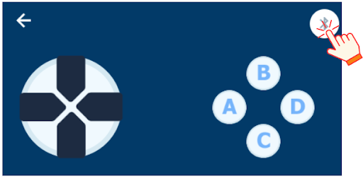

20. Thuyền điện
=========

1. Giới thiệu
-----
-----------

Với hoạt động này, học sinh được tìm hiểu về việc các con tàu truyền thống thường được sử dụng dầu để vận hành, dễ gây ra tình trạng tràn dầu trên biển. Để khắc phục tình trạng này, học sinh cần thiết kế một mô hình thuyền điện có thể di chuyển trên mặt nước để vận chuyển hàng hóa. 

Các kiến thức và kỹ năng đạt được trong dự án này như sau: 

..  csv-table:: 
    :widths: 15, 45

    "**Khoa học & Toán học**", "- Vấn đề thường xảy ra khi các con tàu di chuyển trên biển
    - Biện pháp khắc phục
    - Tìm hiểu về động cơ
    - Lập trình điều khiển động cơ bằng gamepad"
    "**Công nghệ**", "Động cơ DC"
    "**Kỹ thuật**", "Thiết kế, sáng tạo, hoàn thiện mô hình"
    "**Nghệ thuật**", "Mô hình bắt mắt, trang trí và tô màu"
    "**Kỹ năng**", "Kỹ năng thiết kế theo quy trình TK kỹ thuật"

2. Hướng dẫn lắp ráp
----
--------

- **Chuẩn bị**: 

|

- **Hướng dẫn lắp ráp**:

    **Đang cập nhật**

- **Kết nối dây**:

    + Kết nối 2 động cơ DC vào cổng M1 và M2
    + Kết nối cảm biến siêu âm vào cổng A

|

3. Hướng dẫn lập trình
--------
--------

1. Viết chương trình như sau:

**Chương trình đang được cập nhật**

2. Sau khi gửi chương trình xuống Yolo:Bit, bạn thoát khỏi chế độ lập trình, ở về màn hình chính của Yolo:Bit và chọn **Điều khiển**. 

.. image:: images/robot_van_chuyen_3.png
    :scale: 90%
    :align: center 
|

3. Lúc này, giao diện hiển thị như hình dưới, kết nối Bluetooth với Yolo:Bit và nhấn nút điều khiển di chuyển. 

|

