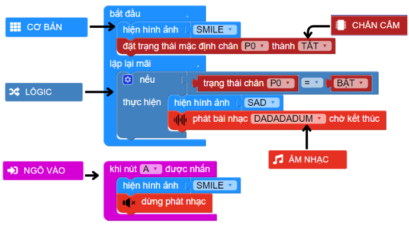

12. Trò chơi luồn dây
=========

1. Giới thiệu
-----
-----------

Với dự án này, học sinh được thực hiện một trò chơi thử thách sự kiên nhẫn được xuất hiện rất nhiều trong các ngày lễ hội hoặc ở hội chợ. Trong trò chơi này, người chơi chỉ cần sử dụng một thanh kẽm ngắn, đã được móc câu thành hình vòng cung, sau đó di chuyển từ đầu đến cuối một thanh kẽm dài khác, sao cho 2 dây không chạm nhau. Nếu 2 thanh chạm nhau sẽ thua cuộc.

Trong bài hướng dẫn này, học sinh tạo ra một mô hình tương tự cùng Yolo:Bit. Nếu 2 thanh kẽm chạm nhau, Yolo:Bit sẽ chớp tắt đèn LED RGB, đồng thời phát ra âm thanh để báo hiệu người chơi đã thua cuộc. 

Các kiến thức và kỹ năng đạt được trong dự án này như sau: 

..  csv-table:: 
    :widths: 15, 45

    "**Khoa học & Toán học**", "- Tìm hiểu về điện và mạch điện
    - Nguyên lý hoạt động của mạch điện
    - Lập trình Yolo:Bit điều khiển chân tín hiệu để bật tắt mạch điện"
    "**Công nghệ**", "Chân tín hiệu trên Yolo:Bit"
    "**Kỹ thuật**", "Thiết kế, sáng tạo, hoàn thiện mô hình"
    "**Nghệ thuật**", "Mô hình bắt mắt, trang trí và tô màu"
    "**Kỹ năng**", "Thuyết trình, kỹ năng thiết kế theo quy trình TK kỹ thuật, KN sử dụng các công cụ cầm tay: kéo, súng bắn keo …."

2. Hướng dẫn lắp ráp
----
--------

- **Chuẩn bị**: 

    + Yolo:Bit 
    + 2 dây kẹp cá sấu
    + 2 thanh kẽm: 1 thanh dài 5cm và 1 thanh dài 25cm

- **Hướng dẫn lắp ráp**:

    + Bước 1: Thiết kế mô hình theo ý tưởng của mình

    .. figure:: images/luon_day.png
        :scale: 90%
        :align: center

        Vẽ ý tưởng ra giấy

    + Bước 2: Uốn cong dây kẽm theo hình vẽ và gắn lên hộp giấy

    .. figure:: images/luon_day_2.png
        :scale: 90%
        :align: center 

        Nối dây kẽm dài vào hộp giấy bất kỳ

    + Bước 3: Nối dây

        - 1 dây kèm nối chân P0 
        - 1 dây kẽm nối chân P3
        - Gắn pin lên Yolo:Bit

    .. image:: images/luon_day_3.png
        :scale: 90%
        :align: center 
    |

3. Hướng dẫn lập trình
--------
--------

Viết chương trình như sau: 

|

**Link chương trình:** `<https://app.ohstem.vn/#!/share/yolobit/2dqZ9Kni40bNfFhGrWWlKSwfLzx>`_

.. note:: 

    Khi chương trình bắt đầu, chúng ta sẽ đổi trạng thái mặc định của chân P0 thành tắt. Trong quá trình chơi game, nếu 2 thanh kẽm chạm nhau, khi đó chân P0 sẽ bật tạo thành một mạch điện hoàn chỉnh, lúc này sẽ hiện hình ảnh SAD và phát bài nhạc DADADADUM để báo hiệu. 
    
    Sau khi 2 thanh kẽm chạm nhau, trò chơi kết thúc, lúc này chỉ cần nhấn nút A để bắt đầu lại trò chơi. 

