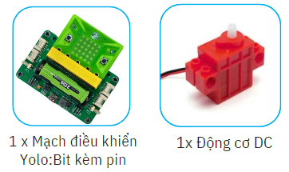
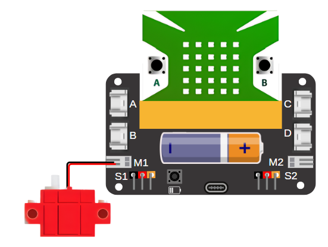
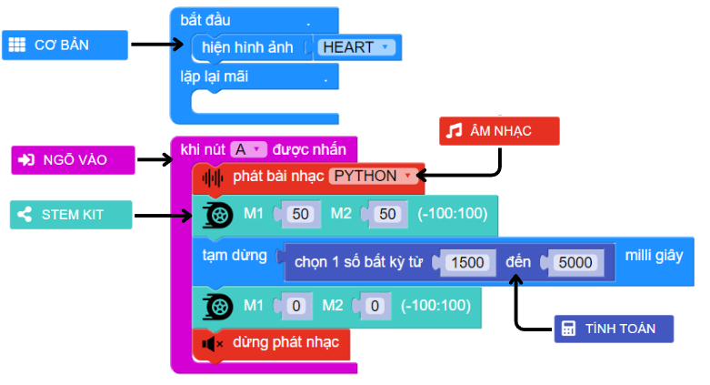

13. Vòng quay may mắn
=========

1. Giới thiệu
-----
-----------

“Vòng quay may mắn” là một trò chơi phổ biến trong các lớp học hay các dịp lễ hội. Chẳng hạn như, dùng để chọn ngẫu nhiên một câu hỏi hay một bạn nào đó trong lớp để kiểm tra bài cũ, hay trò chơi chọn những phần quà may mắn, bằng cách điền các thông tin cần chọn lên vòng xoay. 

Các kiến thức và kỹ năng đạt được trong dự án này như sau: 

..  csv-table:: 
    :widths: 15, 45

    "**Khoa học & Toán học**", "- Tìm hiểu nguyên lý hoạt của mô hình vòng quay 
    - Lập trình điều khiển động cơ DC"
    "**Công nghệ**", "Động cơ DC"
    "**Kỹ thuật**", "Thiết kế, sáng tạo, hoàn thiện mô hình"
    "**Nghệ thuật**", "Mô hình bắt mắt, trang trí và tô màu"
    "**Kỹ năng**", "Thuyết trình, kỹ năng thiết kế theo quy trình TK kỹ thuật, KN sử dụng các công cụ cầm tay: kéo, súng bắn keo …."

2. Hướng dẫn lắp ráp
----
--------

- **Chuẩn bị**: 

|

- **Hướng dẫn lắp ráp**:

    **Đang cập nhật**

- **Kết nối dây**:

    + Kết nối động cơ DC vào cổng M1

|

3. Hướng dẫn lập trình
--------
--------

Viết chương trình như sau: 

|

**Link chương trình:** `<https://app.ohstem.vn/#!/share/yolobit/2dqjecz4C7yqjNFU2lSh0Jxht7S>`_

.. note:: Chương trình sẽ thực hiện như sau: 

    Sau mỗi khi nút A được nhấn, Yolo:Bit sẽ âm thanh báo hiệu, sau đó động cơ sẽ làm cho vòng quay xoay tròn và dừng lại tại một vị trí ngẫu nhiên trong thời gian từ 1.5 đến 5 giây. Lúc này, chúng ta sẽ cho động cơ quay với tốc độ 0, đồng nghĩa với ngừng quay động cơ.

