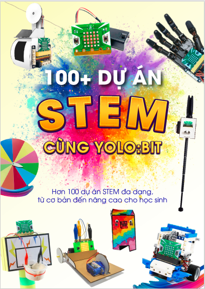

3. Giáo trình 100+ dự án STEM cùng Yolo:Bit
=============

|

**Giới thiệu về giáo trình**
----------
-------------

Việc đưa khoa học, công nghệ vào giảng dạy sẽ là bước đệm để các bạn học sinh có thể nhanh chóng bắt kịp và hòa nhịp được với các kiến thức về khoa học và kỹ thuật. 

Cuốn sách này nhằm mục đích truyền cảm hứng, phát triển tư duy logic và sáng tạo của từng bạn trẻ thông qua việc học về khoa học máy tính và lập trình. Các phụ huynh, giáo viên cũng có thể sử dụng cuốn sách này để tham khảo và ứng dụng giảng dạy lập trình theo hướng STEM. 

Tài liệu này sẽ sử dụng phần cứng là máy tính mini Yolo:Bit và phần mềm lập trình là OhStem App. 

**Cấu trúc giáo trình**
----------
-------------

Các dự án trong cuốn sách này được sắp xếp theo thứ tự từ dễ đến khó, giúp các bạn trẻ dần làm quen với lập trình tốt hơn. 

Mỗi dự án đều có hướng dẫn chi tiết kèm theo hình ảnh minh họa ở từng bước làm giúp người đọc dễ tiếp cận và thực hành theo. 

Cuốn sách được chia thành 5 phần như sau:

- Phần 1: Lập trình thật là dễ
- Phần 2: Sáng tạo thật là vui
- Phần 3: Nào cùng lập trình Game
- Phần 4: Trí thông minh của máy
- Phần 5: Nhà sáng chế tài năng 

**Tải giáo trình 100+ dự án STEM cùng Yolo:Bit:** `Tải về <https://drive.google.com/file/d/1hJHXpgJwEkixNfvi2v9x_x4or5-RkKgO/view>`_
-----------
--------

