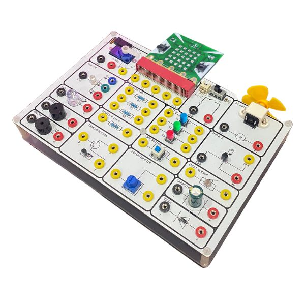
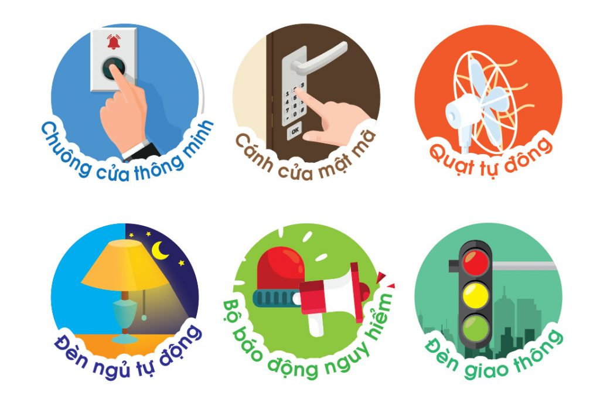

5. Tài liệu thực hành mạch điện với Phys:Bit V2
============

|

**Giới thiệu**
----------
--------

Bộ thực hành lắp ráp mạch điện tử Phys:Bit sẽ dẫn chúng ta trải nghiệm thế giới điện tử lý thú, với những dự án sinh động và phổ biến mô phỏng trong thực tế. Bộ Kit này sẽ giới thiệu đến bạn các khái niệm cơ bản về dòng điện, làm sao để thiết kế một mạch điện và hiểu về cách thức hoạt động của chúng.

Với bộ tài liệu đi kèm, giúp các em học sinh hiểu rõ hơn về nguyên ý hoạt động của mạch điện và các thành phần chính trong mạch điện, biết cách sử dụng vi điều khiển để điều khiển các tín hiệu điện, làm quen với các loại cảm biến hay cơ chế đóng ngắt cơ bản. 

Các em cũng sẽ hiểu về cách các thiết bị điện quanh ta vận hành như thế nào và có thể sáng tạo ra nhiều ứng dụng hay thông qua các dự án mẫu như:   

    Một số mạch điện mẫu

Phys:Bit sử dụng dây cắm banana đơn giản và an toàn cho người sử dụng, còn có nhiều linh kiện điện tử phổ biến như động cơ quạt mini, đèn LED, điện trở, cảm biến ánh sáng,… để bạn thực hành lắp ráp mạch điện và sáng tạo các dự án theo ý thích. 

**Bạn có thể mua Bộ mạch điện tử Phys:Bit, bằng cách nhấn vào giỏ hàng bên dưới:**

..  image:: images/gio.png
    :alt: some image
    :target: https://ohstem.vn/product/lap-rap-mach-dien-physbit/
    :class: with-shadow
    :scale: 100%
    :align: center
|

**Cấu trúc của tài liệu**
--------------------
-----------

Bộ tài liệu sẽ chia thành 2 quyển:

    - **Quyển 1:**  `Xem tại đây <https://drive.google.com/file/d/1pqsgGD6hs32kAs3aYlRHwegQDhaFzhKt/view?usp=sharing>`_

        ..  figure:: images/physbit_2.png
            :scale: 60%
            :align: center 

            Quyển 1

        Hướng dẫn thực hành các thí nghiệm điện tử không sử dụng vi điều khiển, giúp các bạn học sinh hiểu rõ hơn về nguyên lý hoạt động của linh kiện thường được sử dụng trong mạch điện. 

    - **Quyển 2:** `Xem tại đây <https://drive.google.com/file/d/1wl3sbynp-QwneKAtIyoVA_XewSU2am6Q/view?usp=sharing>`_ 

        ..  figure:: images/physbit_3.png
            :scale: 60%
            :align: center 

            Quyển 2

        Tài liệu được chia thành 3 phần với các dự án thực hiện với vi điều khiển là Yolo:Bit, đi từ cơ bản đến nâng cao: 

        + Phần 1: Đèn LED và ánh sáng
        + Phần 2: Âm thanh và còi báo
        + Phần 3: Động cơ
 

        

