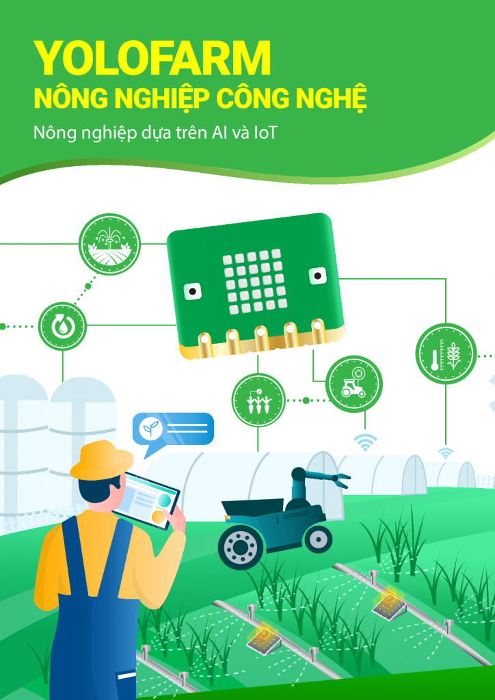
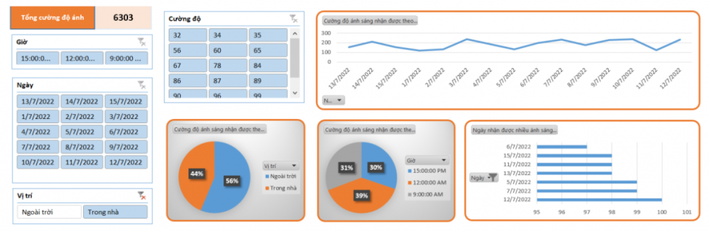

1. Giáo trình STEM nông nghiệp thông minh cùng Yolo:Bit
=========================

|

**Giới thiệu giáo trình STEM Nông nghiệp thông minh**
----------
--------------

Bên cạnh việc tích hợp các kiến thức cũ để hiện thực một dự án hoàn chỉnh, chúng tôi trình bày một phương pháp hiện đại để tiếp cận với kiến thức công nghệ, đó là học tập qua dự án (project based learning).

Khả năng tổ chức và phát triển chương trình qua mỗi bày hướng dẫn là mục tiêu chính của phần này. Nhiều tính năng thông minh và gần gũi với thực tế được đưa vào dự án.

Bên cạnh đó, chúng tôi cũng giới thiệu những khái niệm cơ bản nhất về khoa học dữ liệu. Cụ thể, các giá trị cảm biến thu thập được sẽ được trích xuất và phân tích bằng phần mềm Microsoft Excel, một công cụ vốn đã quen thuộc với đa số bạn đọc.

|

**Cấu trúc giáo trình**
-------------
--------------

Giáo trình được thiết kế dành cho cả những ai chưa có kiến thức nhiều về lập trình, và được chia thành 5 phần riêng biệt từ dễ đến khó:

- Phần 1: Các Thao Tác Cơ Bản Trên Yolo:Bit

- Phần 2: Kết Nối Mở Rộng Cho Yolo:Bit

- Phần 3: Kết Nối Vạn Vật với OhStem

- Phần 4: Trí Tuệ Nhân Tạo

- Phần 5: Hiện Thực Dự Án Yolo:Farm

**Tải giáo trình STEM nông nghiệp thông minh:** `Tải về <https://drive.google.com/file/d/1i1nLZRQHNqLMhBgDO89NNzSlPvJTDnPu/view>`_
-----------
--------

