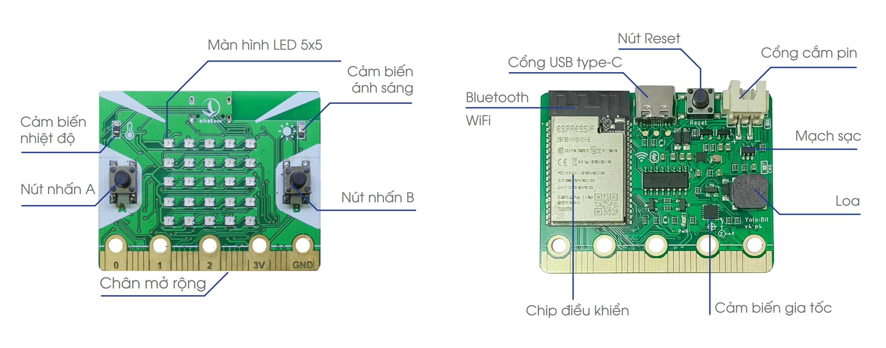
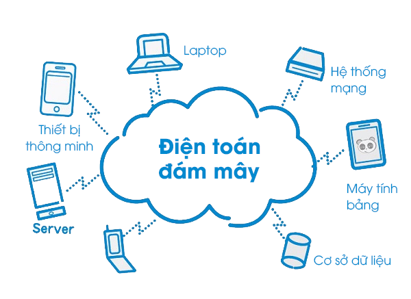

1. Giới thiệu 
==================

**Yolo:Bit** là một mạch lập trình mini được thiết kế để phục vụ việc dạy và học lập trình ở mọi cấp độ, từ học sinh cấp 2, cấp 3, thậm chí là cao đẳng và đại học. Bản thân Yolo:Bit là một máy tính nhúng có hệ điều hành nhỏ (tên là Micro Python), được chạy trên nền tảng chip ESP32. Với việc lập trình trên mạch Yolo:Bit, chúng tôi muốn truyền tải đến bạn đọc khái niệm \textbf{lập trình ứng dụng}, vốn có nhiều khác biệt so với lập trình giải thuật - thường áp dụng trên máy tính đơn thuần.\\

|
Máy tính lập trình Yolo:Bit có lối thiết kế đặc biệt, phù hợp để dạy lập trình cho trẻ nhỏ. Hình dạng và mạch điện được thiết kế dựa theo chuẩn giáo dục của các nước tiên tiến, giúp đảm bảo an toàn cho các em. Mạch Yolo:Bit sử dụng điện áp thấp 3.3V, các góc cạnh được bo tròn, giúp hạn chế tối đa các nguy cơ ảnh hưởng tới trẻ nhỏ khi làm việc với các mạch điện tử.

|

Các mạch như Yolo:Bit có thể chia sẻ dữ liệu giữa nhiều thiết bị tham gia vào mạng và lưu trữ dữ liệu này lên các máy chủ, điện toán đám mây - nơi mà các thiết bị khác có thể nhìn thấy và sử dụng. Đây giống như là một kho kiến thức bổ sung cho các công nghệ về trí tuệ nhân tạo trong tương lai, như minh họa ở hình bên trên.

Trước khi đi vào các ứng dụng nâng cao với Yolo:Bit, chúng ta cần phải thiết lập việc kết nối và lập trình với mạch này. Nội dung chính trong bài đầu tiên bao gồm:

    - Cài đặt driver cho mạch Yolo:Bit
    - Môi trường lập trình trực tuyến
    - Chương trình đầu tiên trên Yolo:Bit
    - Chạy thử và nạp chương trình

