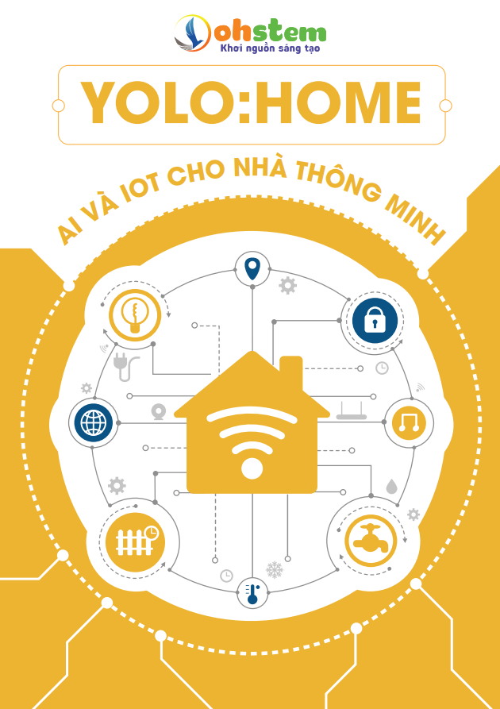

1. Giáo trình AI và IOT cho nhà thông minh 
==================

|

**Giới thiệu về giáo trình**
----------
-------------

Cùng với sự phát tiển công nghệ, **Nhà thông minh** (Smart Home) theo đó cũng sẽ xuất hiện nhiều hơn. Đây là một sản phẩm của công nghệ, được tích hợp các thiết bị điện tử được điều khiển, giám sát, truy cập từ xa nhờ sự chia sẻ đữ liệu mạnh mẽ trên nền tảng kết nối vạn vật (IoT), cộng với sự mềm dẻo của trí tuệ nhân tạo (AI).

Trong giáo trình này, chúng tôi sẽ cung cấp cho bạn đọc các kiến thức cơ bản về việc áp dụng các công nghệ vào một ứng dụng cụ thể là **Yolo - Home- nhà thông minh**, vốn là một chủ đề khá phổ biến trong giáo dục STEM. 

Bên cạnh làm quen với các tính năng như điều khiển các thiết bị bằng giọng nói, chúng ta có thể theo dõi các thông tin về điều kiện trong nhà như nhiệt độ và độ ẩm không khí. Thêm nữa, việc nhận dạng khuôn mặt có thể bổ sung cho tính năng cửa thông minh cho chủ đề nhà thông minh. Bạn cũng có thể tự xây dựng **trợ lý ảo nhân tạo** - Một trong những tính năng đang được áp dụng rất nhiều trong các Smart Home thực tế.

**Cấu trúc giáo trình**
----------
-------------

Giáo trình sẽ chia thành các phần từ cơ bản đến nâng cao để giúp bạn hoàn thiện dự án như sau: 

- Phần 1: Các Thao Tác Cơ Bản Trên Yolo:Bit

- Phần 2: Kết Nối Mở Rộng Cho Yolo:Bit

- Phần 3: Kết Nối Vạn Vật với OhStem

- Phần 4: Trí Tuệ Nhân Tạo

- Phần 5: Hiện Thực Dự Án Yolo:Home

**Tải giáo trình AI và IOT cho nhà thông minh :** `Tải về <https://drive.google.com/file/d/1_i5X7eNRt0A48ETs669PU__vfq0MPb8_/view?usp=sharing>`_
-----------
--------
