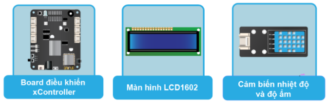
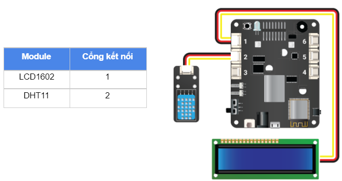

12. Bài học 11: Theo dõi nhiệt độ, độ ẩm trên LCD
====================

Mục tiêu
-----------

Trong bài học này, chúng ta cùng tìm hiểu cảm biến DHT11 - một loại cảm biến đo được nhiệt độ và độ ẩm của môi trường xung quanh. Chúng ta sẽ lập trình hiển thị các thông tin đọc được từ cảm biến này lên màn hình LCD mà chúng ta đã làm quen ở bài học trước.

Thiết bị cần sử dụng
-----------

Kết nối phần cứng
-----------

Viết chương trình
--------------

Mở phần mềm Arduino IDE.

Copy đoạn code sau, click vào nút ``Verify`` để kiểm tra lỗi chương trình. Sau khi biên dịch không báo lỗi, bạn có thể nạp đoạn code vào board.

.. code-block:: guess

  #include <LCD_1602.h>
  #include <DHTesp.h>
              
  const int DHTPIN = D2_1;

  DHTesp dht;
  LCD_1602 lcd(0x21);

  void setup() {
    lcd.begin(D1_1, D1_2);
    lcd.backlight();
    dht.setup(DHTPIN, DHTesp::DHT11);
  }
  
  void loop() {
      // chờ 2s giữa các lần đọc cảm biến
      delay(2000);
      lcd.clear();
      float h = dht.getHumidity();    
      float t = dht.getTemperature(); 
      if (dht.getStatus() != 0) {
        lcd.print("Read sensor faiLED!");
        return;
      }
      lcd.setCursor(0, 0);
      lcd.print("Temp:     ");
      lcd.print(t);
      lcd.print("C");
      lcd.setCursor(0, 1);
      lcd.print("Humidity: ");
      lcd.print(h);
      lcd.print("%");
  }

Giải thích chương trình
--------------

.. code-block:: guess

  #include <DHTesp.h>

Khai báo thư viện ``DHTesp`` để có thể làm việc được với cảm biến DHT11.

.. code-block:: guess

  const int DHTPIN = D2_1;

Khai báo chân IO nối với cảm biến. Do module cảm biến DHT11 nối vào cổng 2 nên chân IO sẽ là ``D2_1`` (vì cảm biến này chỉ dùng 1 chân tín hiệu Digital).

.. code-block:: guess

  DHTesp dht;

Khai báo và tạo đối tượng để làm việc với cảm biến DHT11.

.. code-block:: guess

  dht.setup(DHTPIN, DHTesp::DHT11);

Khởi tạo đối tượng ``dht`` và khai báo cảm biến DHT11.

.. code-block:: guess

  float h = dht.getHumidity();
  float t = dht.getTemperature();

Đọc 2 thông tin về độ ẩm (``Humidity``) và nhiệt độ (``Temperature``) của môi trường từ cảm biến và lưu vào các biến có tên là ``h`` và ``t``. 

*Lưu ý:* Do kết quả trả về có thể là số thập phân nên kiểu dữ liệu của 2 biến này là ``float`` (dùng cho các số thập phân) thay vì kiểu ``int`` (số nguyên) như ta đã dùng trong các bài học trước.

.. code-block:: guess

  if (dht.getStatus() != 0) {
      lcd.print("Read sensor faiLED!");
      return;
  }

Chúng ta cần kiểm tra lỗi xảy ra nếu có trong quá trình đọc giá trị cảm biến. Nếu bị lỗi, hàm ``getStatus()`` sẽ trả về một mã lỗi khác 0. Khi có lỗi xảy ra, chúng ta in ra thông báo trên màn hình LCD.

.. code-block:: guess

  lcd.setCursor(0, 0);
  lcd.print("Temp:     ");
  lcd.print(t);
  lcd.print("C");
  lcd.setCursor(0, 1);
  lcd.print("Humidity: ");
  lcd.print(h);
  lcd.print("%");

Đoạn lệnh này in ra kết quả đọc được trên 2 dòng của màn hình.

*Sau khi chạy chương trình, bạn sẽ thấy giá trị nhiệt độ và độ ẩm được hiển thị trên màn hình LCD. Bạn thử thổi liên tục vào cảm biến để thấy sự thay đổi cả về nhiệt độ và độ ẩm.*
