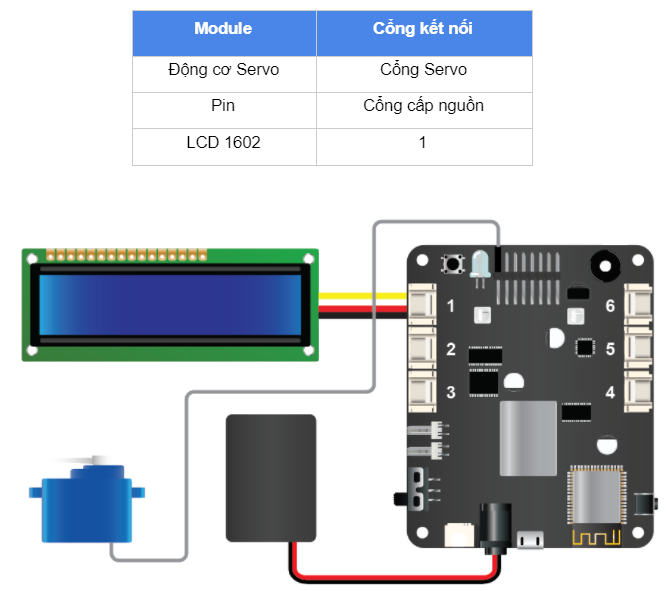

Project 5: Cửa thông minh
====================

Mục tiêu
-----------

Mỗi khi về đến nhà, nếu trong tay đang phải xách rất nhiều đồ đạc mà lại phải dùng chìa khóa để mở cửa thì cũng phiền bạn nhỉ? Chúng ta hãy làm một giải pháp khóa cửa thông minh như sau:

  - Nhấn nút A trên remote để khóa cửa.
  - Nhấn nút B trên remote để bắt đầu nhập mật mã và nút C để kết thúc quá trình nhập.
  - Trong khi nhập mật mã, thông tin sẽ được hiển thị lên màn hình LCD.
  - Nếu mật mã nhập đúng, cửa sẽ mở ra.

Chúng ta sẽ dùng động cơ Servo để đóng và mở cửa ngôi nhà.

Thiết bị cần sử dụng
-----------

.. image:: images/project-5-1.png
  :width: 600
  :align: center

Kết nối phần cứng
-----------

Viết chương trình
--------------

  - Mở phần mềm uPyCraft.
  - Tạo một file chương trình mới (``File > New``) và lưu với tên main.py bằng cách chọn menu ``File > Save…``.
  - Copy đoạn code sau, click vào nút ``DownloadAndRun`` để chạy chương trình.

.. code-block:: python

  from ir_receiver import *; ir_rx.start();

  passcode_auth = '1234' # khai báo mật khẩu cố định
  servo.position(0, 0)
  lcd1602.backlight_off()

  while True:
    if ir_rx.get_code() == IR_REMOTE_A:
      # khóa cửa lại
      servo.position(0, 0)
    elif ir_rx.get_code() == IR_REMOTE_B:
      # bắt đầu nhập mật mã
      lcd1602.clear()
      lcd1602.move_to(0, 0)
      lcd1602.putstr('Hay nhap mat ma:')
      passcode = ''
      while not (ir_rx.get_code() == IR_REMOTE_C):
        # liên tục đọc tín hiệu remote để nhập
        # mật mã cho đến khi phím C được nhấn
        print(ir_rx.get_raw_code())
        if ir_rx.get_code() == IR_REMOTE_0:
          passcode = str(passcode) + '0'
        if ir_rx.get_code() == IR_REMOTE_1:
          passcode = str(passcode) + '1'
        if ir_rx.get_code() == IR_REMOTE_2:
          passcode = str(passcode) + '2'
        if ir_rx.get_code() == IR_REMOTE_3:
          passcode = str(passcode) + '3'
        if ir_rx.get_code() == IR_REMOTE_4:
          passcode = str(passcode) + '4'
        if ir_rx.get_code() == IR_REMOTE_5:
          passcode = str(passcode) + '5'
        if ir_rx.get_code() == IR_REMOTE_6:
          passcode = str(passcode) + '6'
        if ir_rx.get_code() == IR_REMOTE_7:
          passcode = str(passcode) + '7'
        if ir_rx.get_code() == IR_REMOTE_8:
          passcode = str(passcode) + '8'
        if ir_rx.get_code() == IR_REMOTE_9:
          passcode = str(passcode) + '9'
        lcd1602.move_to(0, 1)
        lcd1602.putstr(passcode)
        time.sleep(0.5)
      // nhập mật mã đã xong, cần kiểm tra
      if passcode == passcode_auth:
        lcd1602.move_to(0, 1)
        lcd1602.putstr('Mat ma dung')
        servo.position(0, 90)
      else:
        lcd1602.move_to(0, 1)
        lcd1602.putstr('Mat ma sai')

Giải thích chương trình
--------------

.. code-block:: python

  passcode_auth = '1234'

Khai báo mật mã của ngôi nhà là 4 số “1234”.

.. code-block:: python

  servo.position(0, 0)

Ta cho Servo quay về góc 0 độ (vị trí mà cửa được khóa).

.. code-block:: python

  servo.position(index, degree)

Hàm điều khiển động cơ servo 180 độ quay tới một góc nào đó tức thời. Trong đó:

  - ``index`` là tham số có giá trị 0 ~ 7 tương ứng với 8 cổng gắn servo trên board xController.
  - ``degree`` là tham số góc quay của servo có giá trị 0 ~ 180 độ.

.. code-block:: python

  if ir_rx.get_code() == IR_REMOTE_A:
    servo.position(0, 0)

Trong vòng lặp while True, chúng ta liên tục kiểm tra tín hiệu từ remote. 

Nếu phím A được nhấn thì sẽ khóa cửa lại bằng cách cho Servo quay về góc 0 độ (nếu đang mở).

.. code-block:: python

  elif ir_rx.get_code() == IR_REMOTE_B:
    lcd1602.clear()
    lcd1602.move_to(0, 0)
    lcd1602.putstr('Hay nhap mat ma:')
    passcode = ''

Nếu phím B được nhấn, ta sẽ xóa trắng màn hình LCD và hiển thị thông báo: “Hãy nhập mật mã”. Biến ``passcode`` có chức năng lưu mật mã đang nhập để kiểm tra sau khi nhập xong.

.. code-block:: python

  while not (ir_rx.get_code() == IR_REMOTE_C):
        print(ir_rx.get_raw_code())
        if ir_rx.get_code() == IR_REMOTE_0:
          passcode = str(passcode) + '0'
        if ir_rx.get_code() == IR_REMOTE_1:
          passcode = str(passcode) + '1'
        if ir_rx.get_code() == IR_REMOTE_2:
          passcode = str(passcode) + '2'
        if ir_rx.get_code() == IR_REMOTE_3:
          passcode = str(passcode) + '3'
        if ir_rx.get_code() == IR_REMOTE_4:
          passcode = str(passcode) + '4'
        if ir_rx.get_code() == IR_REMOTE_5:
          passcode = str(passcode) + '5'
        if ir_rx.get_code() == IR_REMOTE_6:
          passcode = str(passcode) + '6'
        if ir_rx.get_code() == IR_REMOTE_7:
          passcode = str(passcode) + '7'
        if ir_rx.get_code() == IR_REMOTE_8:
          passcode = str(passcode) + '8'
        if ir_rx.get_code() == IR_REMOTE_9:
          passcode = str(passcode) + '9'
        lcd1602.move_to(0, 1)
        lcd1602.putstr(passcode)
        time.sleep(0.5)

Đây là đoạn code chính để xử lý phần nhập mật mã. Nếu phím được nhấn chưa phải là phím C thì sẽ tiếp tục lưu nút được nhấn vào biến ``passcode`` và hiện lên màn hình LCD.

.. code-block:: python

    if passcode == passcode_auth:
      lcd1602.move_to(0, 1)
      lcd1602.putstr('Mat ma dung')
      servo.position(0, 90)
    else:
      lcd1602.move_to(0, 1)
      lcd1602.putstr('Mat ma sai')

Nếu phím C được nhấn, vòng lặp nhập mật mã sẽ kết thúc. Đến đây, chương trình sẽ kiểm tra mật mã đã nhập (được lưu trong biến ``passcode``) có giống mật mã ta đã khai báo ban đầu không (là ``1234``). 

Nếu giống thì sẽ mở khóa bằng cách cho Servo quay đến góc 90 độ. Ngược lại, nếu mật mã sai thì sẽ thông báo cho người dùng biết.

Như vậy, các bạn đã hoàn thành 5 project để hoàn thiện 5 chức năng khá thú vị của một ngôi nhà thông minh và hiện đại rồi. Bài tập dành cho bạn là hãy tìm cách tổng hợp code của cả 5 project thành một chương trình hoàn chỉnh cho ngôi nhà nhé.
